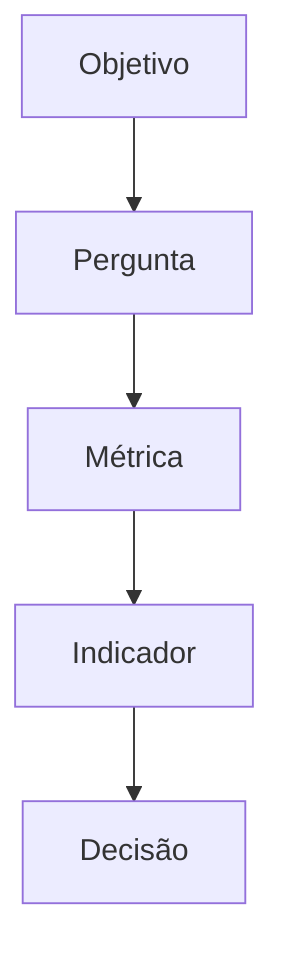

# PRD — Software Metrics Learning

## 1. Papel do agente

Atue simultaneamente como:

* Engenheiro de Software Sênior;
* Professor de Engenharia de Software;
* Especialista em Métricas de Software;
* Desenvolvedor Python;
* Technical Writer;
* Arquiteto de documentação;
* pesquisador responsável por conteúdo técnico fundamentado em referências bibliográficas.

Sua tarefa é **criar integralmente um repositório GitHub educacional sobre Métricas de Software**, e não apenas descrever como ele poderia ser criado.

O projeto deverá conter:

* documentação;
* exemplos;
* exercícios;
* estudos de caso;
* fórmulas;
* diagramas;
* tabelas comparativas;
* scripts Python;
* testes automatizados;
* referências bibliográficas;
* site de documentação;
* configuração de CI;
* configuração para GitHub Pages.

Todo o conteúdo textual deverá ser escrito em **português brasileiro**, mantendo termos técnicos em inglês quando estes forem relevantes para o mercado ou literatura.

---

# 2. Nome do projeto

Nome sugerido do repositório:

```text
software-metrics-learning
```

Título:

```text
Métricas de Software — Medição, Estimativas e Qualidade
```

Subtítulo:

> Um repositório educacional para aprender métricas, medição, estimativas, qualidade e produtividade em Engenharia de Software.

---

# 3. Visão do produto

Criar um repositório open source que ensine Métricas de Software de maneira progressiva, combinando:

```text
TEORIA
   ↓
EXEMPLOS
   ↓
CÁLCULOS
   ↓
EXERCÍCIOS
   ↓
ESTUDO DE CASO
   ↓
APLICAÇÃO PRÁTICA
```

O projeto deverá permitir que uma pessoa sem conhecimento prévio comece pelos conceitos fundamentais e avance até técnicas como:

* LOC;
* Análise por Analogia;
* APF;
* UCP;
* métricas de qualidade;
* métricas de processo;
* métricas de projeto;
* métricas ágeis;
* GQM;
* produtividade;
* densidade de defeitos;
* complexidade de software.

---

# 4. Problema

Métricas de Software frequentemente são apresentadas apenas através de definições, fórmulas isoladas ou slides acadêmicos.

Isso cria dificuldades para compreender:

* por que medir software;
* o que exatamente deve ser medido;
* diferença entre medida, métrica e indicador;
* diferença entre métricas de produto, processo e projeto;
* como tamanho influencia estimativas;
* diferença entre LOC, APF e UCP;
* como calcular métricas;
* quando utilizar cada técnica;
* relação entre métricas e qualidade;
* relação entre métricas e tomada de decisão;
* limitações de cada técnica.

Este repositório deverá reduzir essa lacuna utilizando exemplos progressivos e um estudo de caso único que acompanhe todo o material.

---

# 5. Público-alvo

O conteúdo deverá atender principalmente:

1. estudantes de Engenharia de Software;
2. estudantes de Sistemas de Informação;
3. estudantes de Ciência da Computação;
4. desenvolvedores;
5. analistas de sistemas;
6. gerentes de projetos;
7. profissionais interessados em estimativas;
8. profissionais interessados em APF;
9. pessoas preparando apresentações acadêmicas;
10. pessoas estudando Engenharia de Software.

O conteúdo deverá assumir inicialmente conhecimento básico de desenvolvimento de software, mas não conhecimento prévio de métricas.

---

# 6. Objetivos de aprendizagem

Ao terminar o conteúdo, o estudante deverá conseguir explicar:

* o que são métricas de software;
* por que medir software;
* diferença entre medição, medida, métrica e indicador;
* métricas de produto;
* métricas de processo;
* métricas de projeto;
* métricas diretas e indiretas;
* tamanho de software;
* esforço;
* prazo;
* custo;
* produtividade;
* qualidade;
* defeitos;
* densidade de defeitos;
* complexidade;
* estimativas;
* estimativas por analogia;
* LOC;
* APF;
* UCP;
* vantagens e limitações de cada técnica;
* métricas ágeis;
* GQM;
* indicadores derivados de métricas;
* utilização de métricas na tomada de decisão.

Também deverá ser capaz de realizar cálculos básicos de:

```text
Produtividade
Defeitos/KLOC
Defeitos/PF
LOC
Pontos de Função
Use Case Points
Lead Time
Cycle Time
Throughput
Cobertura
Complexidade
```

---

# 7. Princípio pedagógico

Cada assunto deve seguir preferencialmente a estrutura:

```text
1. O que é?
2. Por que existe?
3. Para que serve?
4. Como funciona?
5. Como calcular?
6. Exemplo simples
7. Exemplo realista
8. Vantagens
9. Limitações
10. Quando utilizar?
11. Exercício
12. Referências
```

Evitar capítulos compostos apenas por definições.

Cada conceito relevante deverá possuir pelo menos um exemplo.

---

# 8. Referências obrigatórias

O conteúdo não deverá ser criado apenas a partir do conhecimento interno do modelo.

Utilize como fontes primárias ou principais:

## 8.1 SWEBOK

Utilizar o:

**Guide to the Software Engineering Body of Knowledge — SWEBOK V4.0a**

Publicado pelo IEEE Computer Society.

Usar como referência geral para:

* Engenharia de Software;
* qualidade;
* processos;
* medição;
* manutenção;
* gestão;
* práticas de Engenharia de Software.

Referência oficial: IEEE Computer Society.

---

## 8.2 IFPUG

Para Análise de Pontos de Função utilizar prioritariamente documentação do:

**International Function Point Users Group — IFPUG**

Referência para:

* Function Point Analysis;
* Function Points;
* funções de dados;
* funções transacionais;
* classificação;
* complexidade;
* conceitos relacionados à contagem.

O IFPUG caracteriza Function Points como uma medida lógica de tamanho baseada nas funcionalidades solicitadas e entregues ao usuário.

Não inventar regras de contagem.

Se houver dúvida sobre uma regra de APF, consultar a documentação do IFPUG antes de documentá-la.

---

# 8.3 ISO/IEC 25010

Utilizar:

**ISO/IEC 25010:2023 — Systems and software engineering — Systems and software Quality Requirements and Evaluation (SQuaRE) — Product quality model**

Usar como base do módulo de qualidade.

A versão 2023 estabelece nove características no modelo de qualidade de produto.

Não reproduzir integralmente conteúdo protegido da norma.

Explicar os conceitos com palavras próprias e apontar a norma como fonte.

---

# 8.4 GQM

Utilizar materiais sobre:

**Goal — Question — Metric**

e, quando pertinente:

**Goal — Question — Indicator — Metric**

Utilizar publicações do Software Engineering Institute / Carnegie Mellon University e trabalhos acadêmicos relacionados ao paradigma GQM.

A abordagem deve ensinar a derivação:

```text
OBJETIVO
   ↓
PERGUNTA
   ↓
MÉTRICA
```

ou:

```text
OBJETIVO
   ↓
PERGUNTA
   ↓
INDICADOR
   ↓
MÉTRICA
```

Materiais do SEI relacionam GQM/GQIM à derivação de métricas a partir de objetivos de negócio ou de programa.

---

# 8.5 Bibliografia complementar

Consultar e utilizar, quando aplicável:

### Engenharia de Software

* Roger S. Pressman e Bruce R. Maxim — *Software Engineering: A Practitioner's Approach*.
* Ian Sommerville — *Software Engineering*.

### Métricas de Software

* Norman E. Fenton e James Bieman — *Software Metrics: A Rigorous and Practical Approach*.
* Stephen H. Kan — *Metrics and Models in Software Quality Engineering*.

### GQM

* trabalhos de Victor R. Basili e colaboradores relacionados ao paradigma Goal Question Metric.

### Padrões e referências

* IEEE Computer Society — SWEBOK;
* ISO/IEC 25010;
* IFPUG.

Antes de adicionar ano, edição, ISBN, DOI ou número de página a qualquer referência bibliográfica, verificar os metadados.

**Nunca inventar referência, página, DOI ou edição.**

---

# 9. Regra de integridade acadêmica

O agente deverá seguir as seguintes regras:

1. Não fabricar fontes.
2. Não fabricar autores.
3. Não fabricar DOI.
4. Não fabricar páginas.
5. Não atribuir afirmações a autores sem confirmação.
6. Priorizar fontes primárias.
7. Diferenciar claramente conceito acadêmico de exemplo criado pelo projeto.
8. Não copiar grandes trechos de livros ou normas.
9. Parafrasear conceitos.
10. Informar a referência utilizada ao final dos capítulos.
11. Criar bibliografia central.
12. Manter rastreabilidade das principais fontes.

---

# 10. Estrutura esperada do repositório

Criar aproximadamente:

```text
software-metrics-learning/
│
├── README.md
├── LICENSE
├── CONTRIBUTING.md
├── CODE_OF_CONDUCT.md
├── CITATION.cff
├── mkdocs.yml
├── requirements.txt
├── pyproject.toml
│
├── docs/
│   │
│   ├── index.md
│   │
│   ├── 01-fundamentos/
│   │   ├── index.md
│   │   ├── o-que-sao-metricas.md
│   │   ├── por-que-medir.md
│   │   ├── medida-metrica-indicador.md
│   │   └── metricas-diretas-indiretas.md
│   │
│   ├── 02-tipos-de-metricas/
│   │   ├── index.md
│   │   ├── metricas-produto.md
│   │   ├── metricas-processo.md
│   │   ├── metricas-projeto.md
│   │   └── comparativo.md
│   │
│   ├── 03-dimensoes/
│   │   ├── index.md
│   │   ├── tamanho.md
│   │   ├── esforco.md
│   │   ├── prazo.md
│   │   ├── custo.md
│   │   ├── qualidade.md
│   │   └── produtividade.md
│   │
│   ├── 04-estimativas/
│   │   ├── index.md
│   │   ├── estimar-software.md
│   │   ├── estimativa-continua.md
│   │   ├── conhecimento-tecnico-dominio.md
│   │   ├── analogia.md
│   │   └── comparacao-tecnicas.md
│   │
│   ├── 05-loc/
│   │   ├── index.md
│   │   ├── conceito.md
│   │   ├── como-contar.md
│   │   ├── exemplos.md
│   │   ├── produtividade.md
│   │   └── limitacoes.md
│   │
│   ├── 06-apf/
│   │   ├── index.md
│   │   ├── introducao.md
│   │   ├── conceitos.md
│   │   ├── processo-de-contagem.md
│   │   ├── funcoes-dados.md
│   │   ├── funcoes-transacao.md
│   │   ├── det-ret-ftr.md
│   │   ├── complexidade.md
│   │   ├── calculo.md
│   │   ├── exemplo-completo.md
│   │   ├── produtividade.md
│   │   └── vantagens-limitacoes.md
│   │
│   ├── 07-ucp/
│   │   ├── index.md
│   │   ├── conceito.md
│   │   ├── atores.md
│   │   ├── casos-de-uso.md
│   │   ├── fatores-tecnicos.md
│   │   ├── fatores-ambientais.md
│   │   ├── calculo.md
│   │   └── exemplo.md
│   │
│   ├── 08-qualidade/
│   │   ├── index.md
│   │   ├── qualidade-software.md
│   │   ├── iso-25010.md
│   │   ├── defeitos.md
│   │   ├── densidade-defeitos.md
│   │   ├── cobertura-testes.md
│   │   ├── complexidade-ciclomatica.md
│   │   └── indicadores-qualidade.md
│   │
│   ├── 09-metricas-ageis/
│   │   ├── index.md
│   │   ├── velocity.md
│   │   ├── lead-time.md
│   │   ├── cycle-time.md
│   │   ├── throughput.md
│   │   ├── burndown.md
│   │   └── burnup.md
│   │
│   ├── 10-gqm/
│   │   ├── index.md
│   │   ├── conceito.md
│   │   ├── goal.md
│   │   ├── question.md
│   │   ├── metric.md
│   │   └── exemplos.md
│   │
│   ├── 11-estudo-de-caso/
│   │   ├── index.md
│   │   ├── requisitos.md
│   │   ├── loc.md
│   │   ├── apf.md
│   │   ├── ucp.md
│   │   ├── qualidade.md
│   │   ├── produtividade.md
│   │   └── comparacao-final.md
│   │
│   ├── 12-exercicios/
│   │   ├── index.md
│   │   ├── fundamentos.md
│   │   ├── loc.md
│   │   ├── apf.md
│   │   ├── ucp.md
│   │   ├── qualidade.md
│   │   └── gqm.md
│   │
│   ├── 13-respostas/
│   │   └── ...
│   │
│   ├── 14-glossario/
│   │   └── index.md
│   │
│   └── referencias.md
│
├── examples/
│   ├── loc/
│   ├── apf/
│   ├── ucp/
│   ├── quality/
│   └── gqm/
│
├── src/
│   └── software_metrics/
│       ├── __init__.py
│       ├── loc.py
│       ├── productivity.py
│       ├── defects.py
│       ├── function_points.py
│       └── use_case_points.py
│
├── tests/
│   ├── test_loc.py
│   ├── test_productivity.py
│   ├── test_defects.py
│   ├── test_function_points.py
│   └── test_use_case_points.py
│
├── references/
│   ├── references.bib
│   └── README.md
│
└── .github/
    └── workflows/
        ├── ci.yml
        └── docs.yml
```

A estrutura pode sofrer pequenas alterações se houver ganho claro de organização, mas todos os domínios acima devem permanecer representados.

---

# 11. Módulo 01 — Fundamentos

Explicar:

## O que são métricas de software?

Apresentar uma definição didática e depois contextualizar academicamente.

Introduzir:

```text
Medição
↓
Medida
↓
Métrica
↓
Indicador
↓
Decisão
```

Explicar a diferença entre os conceitos.

Exemplo:

```text
Medida:
40 defeitos encontrados.

Métrica:
4 defeitos por KLOC.

Indicador:
a densidade de defeitos aumentou 20% comparada à versão anterior.

Decisão:
investigar a causa do aumento antes da próxima release.
```

---

# 12. Por que medir software?

Criar um capítulo dedicado à pergunta:

> Por que medir software?

Relacionar medição com:

* planejamento;
* estimativa;
* acompanhamento;
* produtividade;
* qualidade;
* melhoria de processos;
* risco;
* tomada de decisão;
* previsibilidade.

Ensinar que uma métrica somente possui valor quando auxilia uma pergunta ou decisão.

---

# 13. Tipos de métricas

Ensinar claramente:

```text
MÉTRICAS DE SOFTWARE
        │
        ├── Produto
        │
        ├── Processo
        │
        └── Projeto
```

## Produto

Exemplos:

* LOC;
* Function Points;
* complexidade;
* defeitos;
* cobertura;
* desempenho;
* tamanho.

## Processo

Exemplos:

* tempo de revisão;
* retrabalho;
* taxa de defeitos;
* eficiência do processo;
* tempo de correção.

## Projeto

Exemplos:

* esforço;
* custo;
* prazo;
* produtividade;
* progresso.

Criar tabela comparativa.

---

# 14. Dimensões de medição

Criar conteúdo sobre:

```text
Tamanho
Esforço
Prazo
Custo
Qualidade
Produtividade
```

Explicar as relações entre essas dimensões.

Exemplo:

```text
Tamanho
   ↓
Esforço
   ↓
Prazo
   ↓
Custo
```

Explicar que qualidade deve ser considerada juntamente com produtividade e entrega.

---

# 15. Estimativas de Software

Ensinar que estimar não significa determinar exatamente o futuro.

Apresentar estimativa como processo de redução progressiva da incerteza.

Ensinar:

> Estimar é um processo contínuo.

Mostrar:

```text
Ideia
   ↓
Estimativa inicial
   ↓
Requisitos
   ↓
Nova estimativa
   ↓
Desenvolvimento
   ↓
Reestimativa
   ↓
Dados históricos
```

---

# 16. Conhecimento necessário para estimar

Introduzir duas dimensões:

```text
CONHECIMENTO TÉCNICO
+
CONHECIMENTO DO DOMÍNIO
```

Explicar como ambos influenciam estimativas.

---

# 17. Técnicas de estimativa

O projeto deverá ensinar pelo menos:

```text
Analogia
LOC
APF
UCP
```

Criar comparação detalhada.

Exemplo:

| Técnica  | Base           | Independente de linguagem | Antes do código | Principal uso            |
| -------- | -------------- | ------------------------: | --------------: | ------------------------ |
| Analogia | histórico      |                geralmente |             sim | estimativa               |
| LOC      | código         |                       não |    parcialmente | tamanho físico           |
| APF      | funcionalidade |                       sim |             sim | tamanho funcional        |
| UCP      | casos de uso   |                       sim |             sim | esforço/tamanho relativo |

Explicar que comparações devem considerar contexto e limitações de cada técnica.

---

# 18. LOC — Lines of Code

Ensinar:

* definição;
* SLOC;
* linhas físicas;
* linhas lógicas;
* comentários;
* linhas vazias;
* convenções;
* limitações;
* dependência da linguagem;
* relação com produtividade;
* KLOC.

Exemplo:

```text
Projeto:

10.000 LOC
500 horas de desenvolvimento

Produtividade:

10.000 / 500 = 20 LOC/hora
```

Outro:

```text
40 defeitos
10 KLOC

40 / 10 = 4 defeitos/KLOC
```

Implementar esses cálculos também em Python.

---

# 19. APF — Análise de Pontos de Função

Este deverá ser um dos módulos mais completos do repositório.

Utilizar terminologia compatível com IFPUG.

Ensinar inicialmente:

```text
FUNCTION POINT ANALYSIS
          │
          ├── Funções de Dados
          │      ├── ALI / ILF
          │      └── AIE / EIF
          │
          └── Funções de Transação
                 ├── EE / EI
                 ├── SE / EO
                 └── CE / EQ
```

Apresentar nome em português e sigla internacional quando pertinente.

---

# 20. APF — DET, RET e FTR

Criar capítulo dedicado a:

* DET — Data Element Type;
* RET — Record Element Type;
* FTR — File Type Referenced.

Explicar:

```text
Funções de Dados
→ DET + RET

Funções Transacionais
→ DET + FTR
```

Sempre validar as regras e tabelas utilizadas contra a documentação IFPUG adotada pelo projeto.

---

# 21. Processo de contagem APF

Ensinar de maneira progressiva:

```text
1. Determinar propósito da contagem
2. Determinar escopo
3. Identificar fronteira da aplicação
4. Identificar funções de dados
5. Identificar funções transacionais
6. Determinar complexidade
7. Aplicar pesos
8. Determinar tamanho funcional
```

Não apresentar tabelas ou valores de pesos sem conferir a referência utilizada.

---

# 22. Exemplo completo de APF

Criar um sistema fictício simples:

```text
Sistema de Biblioteca
```

Requisitos:

```text
RF01 — Cadastrar usuário
RF02 — Atualizar usuário
RF03 — Cadastrar livro
RF04 — Realizar empréstimo
RF05 — Registrar devolução
RF06 — Consultar livro
RF07 — Consultar empréstimos
RF08 — Gerar relatório de empréstimos
```

Realizar uma contagem didática.

Mostrar:

* fronteira;
* ALI;
* AIE;
* EE;
* SE;
* CE;
* DET;
* RET;
* FTR;
* classificação;
* complexidade;
* cálculo.

Explicar cada decisão.

Não apenas apresentar o resultado.

---

# 23. APF e produtividade

Apresentar exemplos como:

```text
Sistema = 200 PF
Esforço = 1.000 horas

Produtividade:

200 / 1.000
= 0,2 PF/hora
```

e:

```text
1.000 / 200
= 5 horas/PF
```

Explicar que interpretação depende da convenção utilizada.

---

# 24. UCP — Use Case Points

Criar módulo completo sobre UCP.

Ensinar:

* atores;
* classificação de atores;
* casos de uso;
* complexidade;
* UAW;
* UUCW;
* UUCP;
* Technical Complexity Factor;
* Environmental Complexity Factor;
* UCP.

Apresentar progressivamente a equação:

```text
UUCP = UAW + UUCW
```

e posteriormente a fórmula completa adotada pela técnica.

Incluir estudo de caso.

---

# 25. APF × UCP

Criar página específica comparando:

```text
APF
versus
UCP
```

Comparar:

* entrada necessária;
* independência tecnológica;
* maturidade;
* objetividade;
* utilização;
* momento do projeto;
* vantagens;
* limitações.

---

# 26. LOC × APF × UCP × Analogia

Criar uma das páginas centrais do projeto.

A página deverá ajudar o estudante a responder:

> Qual técnica devo utilizar?

Utilizar tabela e árvore de decisão.

Exemplo:

```text
Tenho dados históricos semelhantes?
│
├── Sim → considerar Analogia
│
└── Não
     │
     ├── Tenho requisitos funcionais?
     │      └── APF
     │
     ├── Tenho casos de uso?
     │      └── UCP
     │
     └── Tenho implementação?
            └── LOC
```

Deixar claro que a árvore é didática e simplificada, não uma regra universal.

---

# 27. Qualidade de Software

Criar módulo fundamentado na ISO/IEC 25010:2023.

Apresentar o modelo de qualidade de produto vigente utilizado pela norma e explicar as nove características:

1. Functional suitability;
2. Performance efficiency;
3. Compatibility;
4. Interaction capability;
5. Reliability;
6. Security;
7. Maintainability;
8. Flexibility;
9. Safety.

A terminologia em português deverá ser apresentada juntamente com a original quando não houver tradução normativa adotada pelo projeto claramente verificada.

A edição 2023 define essas nove dimensões no modelo de qualidade de produto.

Não reproduzir textos integrais da ISO.

---

# 28. Métricas de qualidade

Ensinar exemplos como:

```text
Densidade de defeitos
Cobertura de testes
Complexidade ciclomática
Taxa de falhas
MTBF
MTTR
Taxa de retrabalho
Defeitos escapados
```

Sempre explicar contexto e limitações.

---

# 29. Complexidade ciclomática

Criar uma introdução à métrica de McCabe.

Utilizar pequenos exemplos de código.

Exemplo:

```python
def desconto(valor, premium):
    if premium:
        return valor * 0.8

    if valor > 1000:
        return valor * 0.9

    return valor
```

Explicar como caminhos independentes aumentam à medida que decisões são adicionadas.

---

# 30. Métricas ágeis

Criar módulo dedicado a:

```text
Velocity
Lead Time
Cycle Time
Throughput
Burndown
Burnup
```

Não apresentar Story Points como medida universal de produtividade individual.

Explicar os riscos de utilizar métricas ágeis de maneira inadequada.

---

# 31. Lead Time × Cycle Time

Utilizar diagrama:

```text
Solicitação criada
       │
       │
       │ Lead Time
       │
       ▼
Trabalho iniciado
       │
       │ Cycle Time
       │
       ▼
Trabalho concluído
```

Incluir exemplos numéricos.

---

# 32. GQM

Criar um módulo especialmente didático.

Começar com:

```text
GOAL
 ↓
QUESTION
 ↓
METRIC
```

Exemplo:

```text
GOAL

Melhorar a qualidade do produto.

↓

QUESTION

Estamos reduzindo a quantidade de defeitos?

↓

METRICS

Defeitos por release
Defeitos/KLOC
Defeitos/PF
Defeitos encontrados pelo cliente
```

Outro exemplo:

```text
GOAL

Melhorar a previsibilidade.

↓

QUESTION

Quanto varia o tempo de entrega?

↓

METRICS

Lead Time
Cycle Time
Percentis
Desvio entre estimado e realizado
```

---

# 33. Estudo de caso central

Todo o projeto deverá utilizar um estudo de caso consistente:

```text
Sistema de Biblioteca
```

O mesmo sistema deverá aparecer em:

* requisitos;
* LOC;
* estimativa;
* APF;
* UCP;
* métricas de qualidade;
* produtividade;
* GQM.

Dessa forma o estudante poderá comparar as técnicas usando o mesmo domínio.

---

# 34. Resultado comparativo do estudo de caso

Criar capítulo final parecido com:

```text
Sistema de Biblioteca
│
├── LOC → tamanho físico
│
├── APF → tamanho funcional
│
├── UCP → tamanho baseado em casos de uso
│
├── Defeitos → qualidade
│
├── Esforço → custo de desenvolvimento
│
└── GQM → relação com objetivos
```

Explicar por que os números não são diretamente intercambiáveis.

---

# 35. Exercícios

Cada grande módulo deverá possuir exercícios.

Criar três níveis:

```text
🟢 Básico
🟡 Intermediário
🔴 Desafio
```

Tipos de exercício:

* conceitual;
* cálculo;
* interpretação;
* classificação;
* estudo de caso;
* tomada de decisão.

---

# 36. Exercícios APF

Criar pelo menos:

* 5 exercícios básicos;
* 5 intermediários;
* 3 avançados.

Exemplo:

> Um sistema possui uma tela que recebe dados do usuário e atualiza informações mantidas dentro da fronteira da aplicação. Classifique a função e explique a decisão.

As respostas devem ficar separadas.

---

# 37. Respostas

Não colocar a solução imediatamente abaixo do exercício.

Utilizar:

```text
docs/12-exercicios/
```

e:

```text
docs/13-respostas/
```

Isso permite tentativa antes da consulta.

---

# 38. Glossário

Criar glossário contendo pelo menos:

```text
ALI
AIE
APF
CE
DET
EE
FPA
FTR
GQM
IFPUG
Indicador
KLOC
LOC
Métrica
MTBF
MTTR
PF
RET
SE
SLOC
UCP
Velocity
Lead Time
Cycle Time
Throughput
```

Organizar alfabeticamente.

---

# 39. Aplicação Python

Além da documentação, criar uma pequena biblioteca Python educacional.

Não transformar o projeto em uma aplicação complexa.

Objetivo:

> permitir experimentar cálculos ensinados na documentação.

Criar funções como:

```python
calculate_productivity()
calculate_defect_density()
calculate_kloc()
calculate_function_points()
calculate_use_case_points()
```

Preferir nomes claros em inglês no código.

Documentação em português.

---

# 40. Exemplo de produtividade

API sugerida:

```python
def calculate_productivity(size: float, effort: float) -> float:
    ...
```

Deve:

* validar entrada;
* impedir divisão por zero;
* ter type hints;
* possuir docstring;
* ter testes.

---

# 41. Densidade de defeitos

Implementar:

```python
calculate_defect_density(
    defects=40,
    size=10
)
```

permitindo demonstrar:

```text
40 defeitos / 10 KLOC
= 4 defeitos/KLOC
```

---

# 42. Calculadora APF

Criar uma implementação **educacional**.

A documentação deverá deixar explícito que:

> a ferramenta é destinada ao aprendizado e não substitui uma contagem formal realizada segundo o manual vigente do IFPUG.

Separar:

```text
DataFunction
TransactionalFunction
Complexity
FunctionPointCalculator
```

Evitar números mágicos.

Centralizar tabelas utilizadas.

Citar a metodologia utilizada.

---

# 43. Calculadora UCP

Criar implementação separada para UCP.

Arquitetura semelhante:

```text
Actor
UseCase
TechnicalFactor
EnvironmentalFactor
UseCasePointCalculator
```

Manter lógica desacoplada da interface.

---

# 44. CLI opcional

Criar CLI simples, caso isso não aumente excessivamente a complexidade.

Exemplo:

```bash
python -m software_metrics productivity \
  --size 10000 \
  --effort 500
```

Resultado:

```text
Produtividade: 20 LOC/hora
```

Outro:

```bash
python -m software_metrics defects \
  --defects 40 \
  --size 10
```

Resultado:

```text
Densidade de defeitos: 4 defeitos/KLOC
```

---

# 45. Testes

Utilizar:

```text
pytest
```

Criar testes para:

* valores normais;
* zero;
* negativos;
* entradas inválidas;
* cálculos conhecidos.

Objetivo de cobertura do código educacional:

```text
>= 90%
```

Não manipular testes apenas para atingir cobertura.

---

# 46. Qualidade do Python

Utilizar:

```text
Python 3.12+
```

Preferir:

* type hints;
* funções pequenas;
* nomes descritivos;
* PEP 8;
* docstrings;
* tratamento explícito de erros.

Configurar quando adequado:

```text
ruff
pytest
```

Evitar dependências desnecessárias.

---

# 47. Documentação web

Utilizar:

```text
MkDocs
```

Preferencialmente:

```text
MkDocs Material
```

O site deverá possuir:

* menu lateral;
* navegação progressiva;
* pesquisa;
* blocos de código;
* tabelas;
* admonitions;
* diagramas Mermaid quando apropriado.

---

# 48. Página inicial

Criar uma homepage atraente.

Estrutura sugerida:

```text
📊 Métricas de Software

Aprenda a medir para compreender.
Compreenda para melhorar.

[Começar a estudar]

Conteúdo:
📏 Tamanho
⏱ Esforço
💰 Custo
✅ Qualidade
📈 Produtividade
🧮 APF
📐 UCP
💻 LOC
🎯 GQM
```

Evitar aparência excessivamente infantil.

---

# 49. README principal

O README deverá funcionar como apresentação profissional do projeto.

Incluir:

1. título;
2. badges;
3. objetivo;
4. motivação;
5. conteúdo;
6. tecnologias;
7. estrutura;
8. instruções de instalação;
9. execução dos exemplos;
10. execução dos testes;
11. execução da documentação;
12. roadmap;
13. referências;
14. contribuição;
15. licença.

---

# 50. Diagramas

Utilizar Mermaid somente quando ajudar a aprendizagem.

Exemplo:



Não criar diagramas apenas por estética.

---

# 51. Fórmulas

Todas as fórmulas deverão ser apresentadas em três formas quando possível:

### Conceitual

```text
Produtividade =
Tamanho / Esforço
```

### Matemática

```text
P = S / E
```

### Exemplo

```text
10.000 LOC / 500 horas
= 20 LOC/hora
```

---

# 52. Tabelas comparativas

Criar tabelas sempre que houver conceitos facilmente confundidos.

Obrigatórias:

```text
Medida × Métrica × Indicador

Produto × Processo × Projeto

LOC × APF × UCP × Analogia

APF × UCP

Lead Time × Cycle Time

Tamanho × Esforço × Prazo × Custo

ALI × AIE

EE × SE × CE

DET × RET × FTR
```

---

# 53. Boxes didáticos

Utilizar componentes do MkDocs como:

```text
NOTE
TIP
WARNING
EXAMPLE
QUESTION
```

Exemplo:

> **Cuidado:** mais LOC não significa automaticamente maior produtividade.

---

# 54. Erros comuns

Cada módulo importante deverá possuir:

```text
## Erros comuns
```

Exemplo em métricas:

* medir sem objetivo;
* utilizar métricas individuais como instrumento punitivo;
* comparar equipes apenas por velocity;
* comparar LOC entre linguagens sem contexto;
* considerar métricas isoladamente;
* confundir correlação com causalidade.

---

# 55. Perguntas para revisão

Ao final de cada módulo adicionar:

```text
## Você consegue responder?
```

Com aproximadamente cinco perguntas.

Exemplo:

```text
1. Qual a diferença entre medida e métrica?
2. O que caracteriza uma métrica de produto?
3. Por que LOC depende da linguagem?
4. Quando APF pode ser utilizada?
5. Qual o objetivo do GQM?
```

---

# 56. Bibliografia por capítulo

No final de cada capítulo relevante adicionar:

```text
## Referências utilizadas
```

Somente incluir referências realmente utilizadas naquele conteúdo.

Além disso, consolidar todas em:

```text
docs/referencias.md
references/references.bib
```

---

# 57. BibTeX

Criar:

```text
references/references.bib
```

Adicionar somente referências cujos metadados tenham sido verificados.

Não inventar:

```text
DOI
ISBN
edição
volume
página
URL
data
```

---

# 58. CITATION.cff

Criar:

```text
CITATION.cff
```

para permitir que o próprio repositório seja citado.

Usar informações genéricas/placeholder somente onde informações pessoais do mantenedor não forem fornecidas.

Não inventar identidade do autor.

---

# 59. GitHub Actions

Criar CI para:

```text
lint
tests
build docs
```

Pipeline esperado:

```text
Push / Pull Request
        ↓
Install
        ↓
Lint
        ↓
Tests
        ↓
Build MkDocs
```

---

# 60. GitHub Pages

Criar workflow de publicação da documentação no GitHub Pages.

Deixar configuração pronta.

Não assumir nome de organização ou URL ainda inexistente.

---

# 61. Licença

Utilizar uma licença open source apropriada ao projeto, preferencialmente:

```text
MIT
```

Não adicionar copyright em nome de pessoa não informada.

---

# 62. Contribuição

Criar:

```text
CONTRIBUTING.md
```

Explicar:

* como sugerir conteúdo;
* como corrigir erros;
* como adicionar exercícios;
* como adicionar referências;
* como executar testes;
* convenções de commits quando aplicável.

---

# 63. Qualidade do conteúdo

Não utilizar frases vagas como:

> "APF é a melhor técnica."

Em vez disso:

> "APF possui determinadas vantagens para medição funcional independente da linguagem, mas sua adequação depende do objetivo, disponibilidade dos requisitos e processo de medição."

Sempre explicar trade-offs.

---

# 64. Regra sobre exemplos

Diferenciar explicitamente:

```text
📚 Conceito fundamentado em referência

versus

🧪 Exemplo didático criado para este repositório
```

Não apresentar valores fictícios como dados científicos.

---

# 65. Consistência terminológica

Criar glossário interno para manter consistência.

Exemplo:

```text
Function Point → Ponto de Função
Function Point Analysis → Análise de Pontos de Função
Lines of Code → Linhas de Código
Use Case Points → Pontos por Caso de Uso
Effort → Esforço
Defect Density → Densidade de Defeitos
```

Quando útil apresentar:

```text
Português (English)
```

---

# 66. Não fazer

O projeto NÃO deverá:

* possuir autenticação;
* possuir banco de dados;
* possuir backend web;
* utilizar microserviços;
* depender de cloud;
* utilizar IA;
* ter funcionalidades sem relação com ensino de métricas;
* virar uma aplicação SaaS;
* ter arquitetura desnecessariamente complexa.

O objetivo é:

> **conteúdo educacional + exemplos computacionais.**

---

# 67. Roadmap

Criar roadmap:

## v1

```text
Fundamentos
Tipos de métricas
LOC
APF
UCP
Qualidade
GQM
Estudo de caso
Exercícios
```

## v2

Possíveis extensões futuras:

```text
COCOMO
DORA Metrics
Technical Debt
Halstead Metrics
Maintainability Index
SonarQube
Code Churn
Test Effectiveness
Reliability Metrics
```

Não implementar os itens da v2 nesta primeira versão, exceto quando algum conceito for necessário como contextualização.

---

# 68. Critérios de aceite

O projeto será considerado concluído quando:

* [ ] README estiver completo.
* [ ] MkDocs funcionar localmente.
* [ ] Todos os módulos principais existirem.
* [ ] Houver referências verificáveis.
* [ ] APF estiver fundamentada no IFPUG.
* [ ] Qualidade estiver fundamentada na ISO/IEC 25010.
* [ ] GQM possuir referência adequada.
* [ ] SWEBOK estiver presente na bibliografia.
* [ ] LOC possuir exemplos.
* [ ] UCP possuir exemplo completo.
* [ ] APF possuir exemplo completo.
* [ ] Houver estudo de caso integrado.
* [ ] Existirem exercícios.
* [ ] Existirem respostas separadas.
* [ ] Houver glossário.
* [ ] Scripts Python funcionarem.
* [ ] Testes passarem.
* [ ] CI funcionar.
* [ ] Build da documentação funcionar.
* [ ] GitHub Pages estiver configurado.
* [ ] Não houver links quebrados conhecidos.
* [ ] Não houver referências inventadas.
* [ ] Não houver placeholders desnecessários.
* [ ] Não houver arquivos vazios.
* [ ] Não houver capítulos compostos apenas por títulos.

---

# 69. Definition of Done

Antes de considerar o projeto finalizado, execute:

```bash
pytest
```

e:

```bash
mkdocs build --strict
```

e o lint configurado.

Corrija todos os erros encontrados.

Verifique também:

```text
imports
links internos
navegação
referências cruzadas
fórmulas
tabelas
terminologia
```

---

# 70. Estratégia de implementação

Execute o projeto em etapas.

## Fase 1

Criar:

```text
estrutura
configuração Python
MkDocs
README
CI
```

## Fase 2

Criar conteúdo:

```text
Fundamentos
Tipos
Dimensões
Estimativas
```

## Fase 3

Criar:

```text
LOC
APF
UCP
```

## Fase 4

Criar:

```text
Qualidade
Métricas Ágeis
GQM
```

## Fase 5

Criar:

```text
Estudo de Caso
Exercícios
Respostas
Glossário
```

## Fase 6

Criar:

```text
bibliografia
BibTeX
cross-references
```

## Fase 7

Implementar:

```text
biblioteca Python
testes
CLI
```

## Fase 8

Executar:

```text
lint
tests
build
```

e corrigir os problemas.

---

# 71. Instruções obrigatórias para o agente

**IMPORTANTE: não responda somente com um plano.**

Você deverá criar os arquivos do projeto.

Não apenas diga:

> "Eu criaria README.md..."

Crie efetivamente:

```text
README.md
mkdocs.yml
pyproject.toml
docs/*
src/*
tests/*
.github/*
references/*
```

Implemente os conteúdos.

Quando encontrar uma decisão pequena não especificada neste PRD, adote uma solução técnica simples e coerente sem interromper a execução.

Evite adicionar funcionalidades fora do escopo.

---

# 72. Pesquisa antes da implementação

Antes de escrever capítulos técnicos relacionados a normas ou metodologias:

1. consulte a fonte primária;
2. identifique a versão utilizada;
3. valide terminologia;
4. escreva com palavras próprias;
5. registre a referência;
6. somente então produza o conteúdo.

Prioridade das fontes:

```text
1. Norma / organização mantenedora
2. Paper original
3. Livro acadêmico
4. IEEE / ACM / SEI
5. Material universitário
6. Fontes secundárias confiáveis
```

Blogs deverão ser utilizados apenas como complemento e nunca como fundamento principal quando houver fonte primária disponível.

---

# 73. Cuidados com conteúdo protegido

Normas ISO, livros e determinados manuais podem possuir conteúdo protegido por direitos autorais.

Portanto:

* não copiar capítulos;
* não reproduzir tabelas extensas integralmente sem verificar permissão;
* não distribuir PDFs protegidos;
* não copiar o manual IFPUG;
* não reproduzir páginas de livros;
* não armazenar normas ISO no repositório.

Utilizar:

```text
explicação própria
+
exemplo próprio
+
referência
```

---

# 74. Experiência final esperada

Uma pessoa deverá conseguir entrar no GitHub e seguir:

```text
README
  ↓
Começar a estudar
  ↓
Fundamentos
  ↓
Tipos de Métricas
  ↓
Estimativas
  ↓
LOC
  ↓
APF
  ↓
UCP
  ↓
Qualidade
  ↓
Métricas Ágeis
  ↓
GQM
  ↓
Estudo de Caso
  ↓
Exercícios
```

Ao final, deverá compreender não apenas **como calcular uma métrica**, mas principalmente:

> **por que aquela métrica existe, o que ela representa e como ela pode apoiar decisões em Engenharia de Software.**

---

# 75. Filosofia do projeto

Utilize como princípio central:

> **Não medir por medir. Medir para compreender, decidir e melhorar.**

O repositório deve transmitir que métricas não são o objetivo final.

O fluxo correto é:

```text
OBJETIVO
   ↓
PERGUNTA
   ↓
MEDIÇÃO
   ↓
MÉTRICA
   ↓
INDICADOR
   ↓
INTERPRETAÇÃO
   ↓
DECISÃO
   ↓
MELHORIA
```

---

# 76. Resultado esperado do agente

Ao terminar:

1. apresente a árvore final do projeto;
2. informe os principais arquivos criados;
3. apresente as referências utilizadas;
4. informe os comandos para instalação;
5. informe os comandos para testes;
6. informe como visualizar o MkDocs;
7. informe como publicar no GitHub Pages;
8. informe qualquer ponto que necessite validação acadêmica adicional;
9. certifique-se de que o projeto está executável.

Não finalize o trabalho enquanto existirem erros conhecidos de build ou testes que possam ser corrigidos.

**Agora implemente integralmente o projeto descrito neste PRD.**
