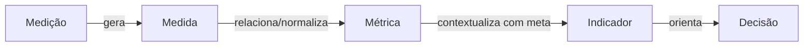

# Medição, Medida, Métrica e Indicador

Um dos erros conceituais mais comuns em Engenharia de Software é tratar os termos **Medição**, **Medida**, **Métrica** e **Indicador** como se fossem sinônimos. Este capítulo estabelece a distinção rigorosa entre eles.

---

## 1. A Cadeia de Valor da Medição

---

## 2. Definições Rigorosas

### Medição (Processo)
É a ação de atribuir números ou símbolos a atributos do mundo real de acordo com uma regra definida.
*Exemplo*: Executar um scanner estático sobre o código-fonte do Sistema de Biblioteca.

### Medida (Dado Bruto)
É o valor numérico quantitativo atribuído diretamente pela medição de um atributo simples.
*Exemplo*: 40 defeitos encontrados.

### Métrica (Dado Relacionado / Normalizado)
É uma medida quantitativa do grau em que um sistema ou processo possui um determinado atributo, geralmente relacionando duas ou mais medidas para permitir comparação.
*Exemplo*: $40 / 10 = 4\text{ defeitos/KLOC}$.

### Indicador (Informação para Decisão)
É uma métrica ou combinação de métricas comparada a um benchmark, meta ou tendência histórica que fornece insights diretos para orientar decisões de gestão ou engenharia.
*Exemplo*: "A densidade de defeitos aumentou 20% em relação ao trimestre anterior (ultrapassando o limite aceitável de 2.5 defeitos/KLOC)".

---

## 3. Tabela Comparativa Obrigatória

| Conceito | Tipo de Elemento | Pergunta que Responde | Exemplo no Sistema de Biblioteca |
| :--- | :--- | :--- | :--- |
| **Medição** | Processo / Ação | "Como coletar a informação?" | Executar contagem de linhas via script. |
| **Medida** | Dado Bruto (Direto) | "Quanto temos em valor absoluto?" | 40 defeitos; 500 horas; 10.000 LOC. |
| **Métrica** | Dado Relacionado | "Qual é a taxa ou proporção?" | 4 defeitos/KLOC; 20 LOC/hora. |
| **Indicador** | Sinal de Decisão | "O resultado é bom, ruim ou crítico?" | "Alerta: taxa de defeitos 20% acima do teto de qualidade da release." |

---

## 4. Exemplo Didático Integrado

!!! example "Cadeia Completa no Sistema de Biblioteca"
    - **Medição**: Coleta automatizada de logs de erro durante os testes.
    - **Medida**: 40 falhas identificadas no modulo de empréstimo.
    - **Métrica**: Densidade de defeitos de 4.0 defeitos/KLOC.
    - **Indicador**: Sinal vermelho no painel de controle de qualidade indicando que a release não pode ir para produção.
    - **Decisão**: Adiar o deploy por 3 dias para refatoração e correção dos módulos críticos.

---

## 5. Erros Comuns
- Apresentar medidas brutas (ex: "temos 50 defeitos") como indicadores de qualidade sem normalizá-las pelo tamanho do código.
- Tomar decisões drásticas com base em métricas isoladas sem construir um indicador contextualizado.

## 6. Você consegue responder?
1. Qual é a diferença fundamental entre uma Medida e uma Métrica?
2. Por que um número absoluto (como 100 defeitos) não é suficiente para avaliar a qualidade de um software?
3. O que transforma uma Métrica em um Indicador?
4. Dê um exemplo da cadeia completa: Medição -> Medida -> Métrica -> Indicador -> Decisão.
5. Por que a normalização é necessária na construção de métricas?

??? check "Mostrar Gabarito / Resposta"
    1. **Medida vs. Métrica:** Uma medida é uma quantificação direta ou bruta (ex: 20 defeitos encontrados), enquanto uma métrica conecta duas ou mais medidas relacionando atributos (ex: 20 defeitos por 1.000 linhas de código).
    2. **Insuficiência do número absoluto:** 100 defeitos em um sistema de 1.000 linhas é gravíssimo (alta densidade), mas 100 defeitos em um sistema de 1.000.000 de linhas indica altíssima qualidade. Sem contexto de escala, o valor bruto ilude.
    3. **Métrica -> Indicador:** Uma métrica torna-se um indicador quando é comparada a uma meta, limiar ou linha de base histórica, fornecendo suporte direto à tomada de decisão.
    4. **Exemplo da cadeia completa:**
       - *Medição:* Executar testes automatizados no sistema de e-commerce.
       - *Medida:* 15 falhas encontradas; 50.000 linhas de código (50 KLOC).
       - *Métrica:* Densidade de 0,3 defeitos / KLOC.
       - *Indicador:* Sinal Verde no Dashboard (Meta da empresa é < 1,0 defeito / KLOC).
       - *Decisão:* Aprovar o software para implantação em produção.
    5. **Necessidade da normalização:** Permite comparar projetos de diferentes tamanhos, linguagens ou complexidades de forma justa e padronizada.

---

## 📚 Referências utilizadas
- **IEEE Computer Society**. *SWEBOK V4.0a*, Chapter 8.
- **Fenton, N. E. & Bieman, J.** *Software Metrics: A Rigorous and Practical Approach*, 3rd ed., 2014.
