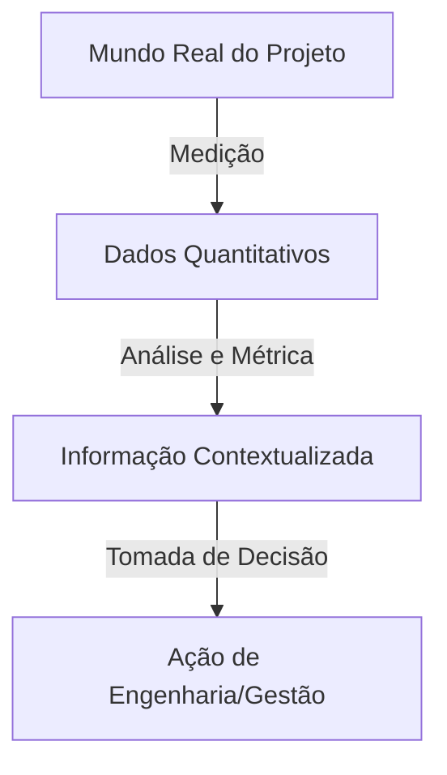

# O que são Métricas de Software?

> 📚 **Conceito fundamentado em referência (SWEBOK / IEEE 610.12)**  
> Uma métrica de software é uma medida quantitativa do grau em que um sistema, componente ou processo possui determinado atributo.

---

## 1. O que é?
Em termos didáticos, uma métrica de software é o instrumento que nos permite transformar aspectos abstratos do desenvolvimento (como tamanho, qualidade, esforço e complexidade) em números compreensíveis e comparáveis.

## 2. Por que existe?
A Engenharia de Software difere da engenharia tradicional por produzir um bem intangível. Sem métricas, as decisões sobre prazos, custos e qualidade ficam restritas a opiniões subjetivas e palpites ("eu acho que o código está ruim" ou "acho que vai demorar duas semanas").

## 3. Para que serve?
Métricas servem para:
- Avaliar o estado atual de um projeto ou produto.
- Prever o comportamento futuro (estimativas).
- Identificar gargalos de produtividade ou focos de defeitos.
- Fornecer embasamento empírico para tomada de decisões.

## 4. Como funciona?
A medição atribui um número ou símbolo a um atributo de uma entidade do software (código, documentos, processos, pessoas) seguindo regras bem definidas.

## 5. Exemplo Simples

!!! example "Exemplo de Métrica de Tamanho"
    Em um script Python com 150 linhas de código executável, a contagem física de linhas é 150 LOC. 

## 6. Exemplo Realista

!!! example "Exemplo no Sistema de Biblioteca"
    No *Sistema de Biblioteca*, o módulo de empréstimos possui 40 defeitos reportados após o deploy em um código de 10.000 linhas de código (10 KLOC). A métrica de **Densidade de Defeitos** é $40 / 10 = 4\text{ defeitos/KLOC}$.

## 7. Vantagens
- Substitui a subjetividade por evidências empíricas.
- Permite comparações históricas entre projetos semelhantes.
- Facilita o acompanhamento de metas de melhoria de processos.

## 8. Limitações
- Números isolados podem enganar se interpretados fora do contexto.
- Métricas mal aplicadas podem gerar comportamentos disfuncionais na equipe (ex: escrever código mais prolixo para aumentar LOC).

## 9. Erros Comuns
- Medir sem um objetivo claro.
- Utilizar métricas individuais para punição ou ranqueamento de desenvolvedores.
- Tratar métricas como vérités absolutas sem analisar fatores qualitativos.

## 10. Você consegue responder?
1. O que diferencia uma estimativa baseada em métricas de um "palpite"?
2. Por que o código ser intangível torna as métricas tão essenciais?
3. Qual é o perigo de usar LOC como métrica de produtividade individual?
4. Como a definição de IEEE 610.12 caracteriza uma métrica?
5. Qual é o primeiro passo para implementar um programa de medição sustentável?

---

## 📚 Referências utilizadas
- **IEEE Computer Society**. *SWEBOK V4.0a*, Chapter 8: Software Engineering Process - Measurement.
- **Fenton, N. E. & Bieman, J.** *Software Metrics: A Rigorous and Practical Approach*, 3rd ed., 2014.
