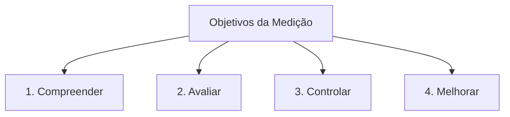

# Por que Medir Software?

> *"Você não pode controlar o que não pode medir."*  
> — Frase atribuída a Tom DeMarco e Lord Kelvin na Engenharia.

---

## 1. O que é?
Este capítulo aborda os motivos fundamentais pelos quais organizações e equipes de engenharia investem recursos no processo de medição de software.

## 2. Por que existe?
Projetos de software são notórios historicamente pelo estouro de prazos e orçamentos (crise do software). A medição existe para introduzir visibilidade e previsibilidade ao processo de desenvolvimento.

## 3. Os Quatro Objetivos Principais da Medição (Basili & Fenton)

1. **Compreender**: Estabelecer linhas de base históricas para entender o estado atual dos processos e produtos.
2. **Avaliar**: Determinar se o produto atende aos requisitos de desempenho, qualidade e conformidade com normas.
3. **Controlar**: Identificar desvios entre o planejado e o realizado durante a execução do projeto para tomar ações corretivas imediatas.
4. **Melhorar**: Avaliar o impacto de mudanças de ferramentas, métodos ou treinamento ao longo do tempo.

---

## 4. Tabela de Relação: Medição vs Decisão de Gestão

| Área de Gestão | Pergunta Sem Medição | Pergunta Com Medição |
| :--- | :--- | :--- |
| **Planejamento** | "Quando acha que termina?" | "Com base no Velocity de 30 pts/sprint, faltam 4 sprints." |
| **Qualidade** | "O sistema está bom?" | "A densidade de defeitos caiu de 5 para 1.2 defeitos/KLOC." |
| **Manutenção** | "O código está confuso?" | "A complexidade ciclomática média das funções é 18 (alto risco)." |

---

## 5. Erros Comuns
- Medir dados apenas para guardar em relatórios sem tomar nenhuma ação baseada neles.
- Acreditar que medir software resolverá problemas de gestão automaticamente.

## 6. Você consegue responder?
1. Quais são os quatro pilares de objetivos da medição propostos por Basili?
2. Como a medição auxilia no controle de desvios durante a execução de um projeto?
3. O que acontece quando uma equipe mede dados mas nunca os utiliza em decisões?
4. Dê um exemplo de como a medição transforma uma afirmação vaga em um indicador concreto.
5. Qual o papel das linhas de base históricas para a melhoria de processos?

---

## 📚 Referências utilizadas
- **Fenton, N. E. & Bieman, J.** *Software Metrics: A Rigorous and Practical Approach*, 3rd ed., 2014.
- **Pressman, R. S. & Maxim, B. R.** *Software Engineering: A Practitioner's Approach*, 9th ed., 2019.
