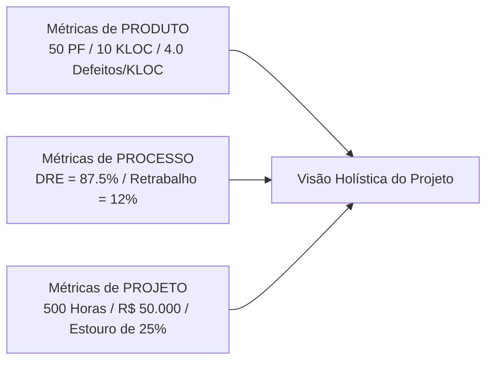

# Comparativo: Produto vs Processo vs Projeto

Para consolidar o aprendizado, este capítulo apresenta o confronto direto entre as três categorias fundamentais de métricas de software.

---

## 1. Tabela Comparativa Obrigatória

| Categoria | Objeto Sob Análise | Usuário Principal | Exemplos Típicos | Principal Decisão Orientada |
| :--- | :--- | :--- | :--- | :--- |
| **Produto** | Artefatos, Código, Documentação | Desenvolvedor, Arquiteto, QA | LOC, APF, UCP, Complexidade Ciclomática, Cobertura | Decisão de refatoração, arquitetura e release de qualidade. |
| **Processo** | Metodologia, Testes, Fluxo de Trabalho | Scrum Master, Líder Técnico, Process Owner | DRE, MTTR, Retrabalho, Lead Time, Cycle Time | Adotar novas ferramentas, ajustar pipeline CI/CD ou treinamento. |
| **Projeto** | Gestão, Cronograma, Recursos | Gerente de Projetos, PMO, Cliente | Esforço (horas), Custo ($), Prazo, Variação de Escopo | Reavaliar prazos, alocação de equipe e orçamento financeiro. |

---

## 2. Visão Integrada no Sistema de Biblioteca

---

## 3. Matriz de Decisão: Quando Usar Cada Tipo?

- **Use Métricas de Produto** quando você precisa decidir se o código está pronto para ir para produção ou se necessita de limpeza/refatoração.
- **Use Métricas de Processo** quando você deseja identificar onde os bugs estão sendo introduzidos ou por que as entregas demoram para sair do ambiente de desenvolvimento.
- **Use Métricas de Projeto** quando precisa informar aos patrocinadores/stakeholders o prazo estimado de conclusão e o custo decorrente.

---

## 4. Você consegue responder?
1. Preencha a lacuna: A densidade de defeitos é uma métrica de _______, enquanto o Lead Time é uma métrica de _______.
2. Qual categoria de métricas é mais relevante para um Arquiteto de Software?
3. Por que o Gerente de Projetos precisa integrar dados das três categorias?
4. Dê um exemplo de como uma decisão errada pode ocorrer ao observar apenas métricas de projeto ignorando métricas de produto.
5. Qual a categoria de métricas mais adequada para avaliar a eficiência de uma esteira de testes automatizados?

---

## 📚 Referências utilizadas
- **Fenton, N. E. & Bieman, J.** *Software Metrics: A Rigorous and Practical Approach*, 3rd ed., 2014.
- **Pressman, R. S. & Maxim, B. R.** *Software Engineering: A Practitioner's Approach*, 9th ed., 2019.
