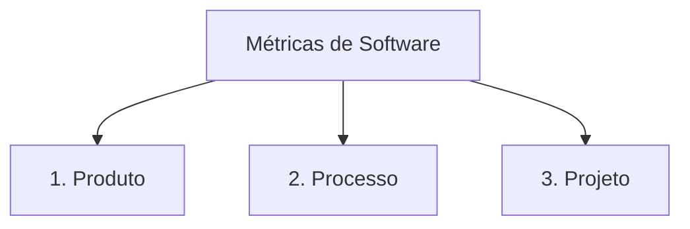

# Módulo 02 — Tipos de Métricas de Software

Em Engenharia de Software, as métricas são categorizadas com base no objeto de estudo ou entidade sob análise.

---

## 🏗️ As Três Grandes Categorias

1. **Métricas de Produto**: Avaliam atributos do próprio artefato entregue (código, documentação, arquitetura).
2. **Métricas de Processo**: Avaliam o ambiente e a eficácia dos métodos de desenvolvimento e testes.
3. **Métricas de Projeto**: Avaliam o progresso, custo, esforço e cronograma da execução do trabalho.

---

## 📖 Capítulos do Módulo

- **[Métricas de Produto](metricas-produto.md)** — Tamanho, complexidade, qualidade e desempenho.
- **[Métricas de Processo](metricas-processo.md)** — Taxa de remoção de defeitos, tempo de ciclo e retrabalho.
- **[Métricas de Projeto](metricas-projeto.md)** — Esforço, prazo, custo e variação de cronograma.
- **[Tabela Comparativa Integrada](comparativo.md)** — Comparativo e matriz de aplicação.
