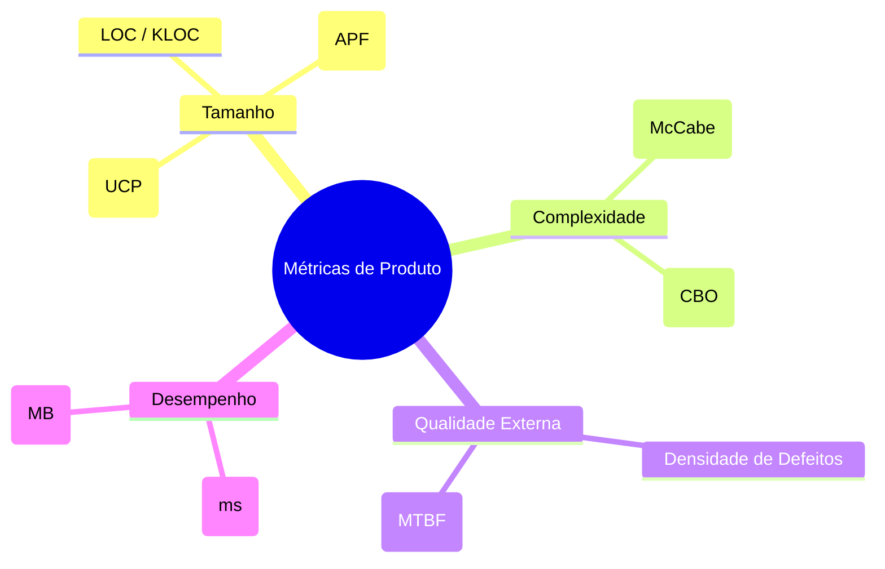

# Métricas de Produto

> 📚 **Conceito fundamentado em referência (SWEBOK / Fenton & Bieman)**  
> Métricas de produto medem atributos do software em qualquer estágio de seu desenvolvimento, variando de requisitos até o código-fonte executável e documentação.

---

## 1. O que são?
Métricas de produto quantificam as características físicas, lógicas e de qualidade do próprio sistema construído.

## 2. Categorias de Atributos de Produto

---

## 3. Exemplos Práticos no Sistema de Biblioteca

!!! example "Tamanho Funcional"
    O módulo de empréstimos do Sistema de Biblioteca possui 50 Pontos de Função (PF) calculados segundo as regras do IFPUG.

!!! example "Complexidade Estrutural"
    A função `realizar_emprestimo()` possui uma Complexidade Ciclomática igual a 5 devido a múltiplos desvios condicionais de validação de usuários pendentes.

---

## 4. Vantagens e Limitações

### Vantagens
- Podem ser extraídas diretamente dos artefatos (código, modelo de dados, requisitos).
- Permitem automatização quase total via ferramentas de análise estática de código (ex: SonarQube, Ruff).

### Limitações
- Uma métrica de produto alta em linhas de código (LOC) não significa necessariamente maior valor para o negócio.

---

## 5. Erros Comuns
- Avaliar a qualidade de um produto apenas pelo seu tamanho físico (LOC).
- Ignorar o acoplamento arquitetural e a coesão ao medir complexidade de produto.

## 6. Você consegue responder?
1. O que caracteriza uma Métrica de Produto?
2. Cite três exemplos de métricas de produto utilizadas em projetos de software.
3. Como a análise estática de código automatiza a coleta de métricas de produto?
4. Qual é a relação entre tamanho de produto (APF/LOC) e a estimativa de esforço?
5. O tempo de resposta de uma API é uma métrica de produto ou de processo? Justifique.

??? check "Mostrar Gabarito / Resposta"
    1. **Métrica de Produto:** É a medição das características ou atributos do próprio entregável de software (como código-fonte, arquitetura, documentação ou executável), independentemente do processo utilizado para construí-lo.
    2. **Exemplos de Métricas de Produto:** Linhas de código (LOC), Pontos de Função (APF), Complexidade Ciclomática e Cobertura de Testes.
    3. **Automação via Análise Estática:** Ferramentas (ex: SonarQube) analisam o código-fonte sem executá-lo, calculando automaticamente acoplamento, complexidade, duplicação e violações de padrões de codificação.
    4. **Tamanho vs. Esforço:** O tamanho (medido em APF ou LOC) serve como entrada principal para modelos empíricos ou históricos de estimativa de esforço (ex: horas necessárias para desenvolvimento).
    5. **Tempo de resposta de API:** É uma métrica de **produto**, pois avalia um atributo de desempenho não-funcional da própria aplicação em execução.

---

## 📚 Referências utilizadas
- **Fenton, N. E. & Bieman, J.** *Software Metrics: A Rigorous and Practical Approach*, 3rd ed., 2014.
- **IEEE Computer Society**. *SWEBOK V4.0a*, Chapter 8.
