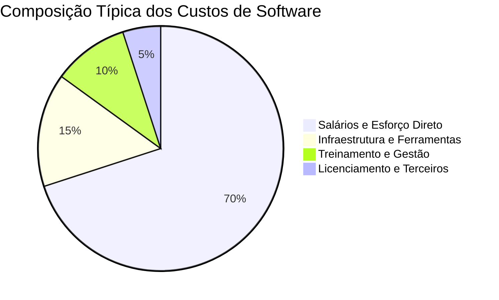

# Dimensão 4: Custo de Software

O **Custo** é o valor financeiro acumulado necessário para produzir, testar, implantar e manter uma solução de software.

---

## 1. Composição do Custo de Software

$$\text{Custo Total} = (\text{Esforço em Horas} \times \text{Custo Médio da Hora}) + \text{Custos Operacionais Indiretos}$$

---

## 2. Exemplo Prático no Sistema de Biblioteca

!!! example "Custo Total de Desenvolvimento"
    No *Sistema de Biblioteca*, foram consumidas 500 horas com um custo médio ponderado por hora de R\$ 100,00/hora.
    $$\text{Custo Direto de Esforço} = 500 \times 100 = \text{R\$ } 50.000,00$$
    Considerando R\$ 5.000,00 de licenças e infraestrutura, o custo total foi de R\$ 55.000,00.  
    $$\text{Custo por Ponto de Função} = \frac{55.000}{50\text{ PF}} = \text{R\$ } 1.100,00/\text{PF}$$

---

## 3. Você consegue responder?
1. Quais são as principais componentes do custo de desenvolvimento de software?
2. Como se calcula o custo por Ponto de Função (R$/PF)?
3. Qual é o peso do esforço humano na composição total do custo de software?
4. O que são custos indiretos ou de overhead em projetos de engenharia?
5. Por que subestimar o esforço afeta diretamente a margem de custo do projeto?

---

## 📚 Referências utilizadas
- **Pressman, R. S. & Maxim, B. R.** *Software Engineering: A Practitioner's Approach*, 9th ed., 2019.
