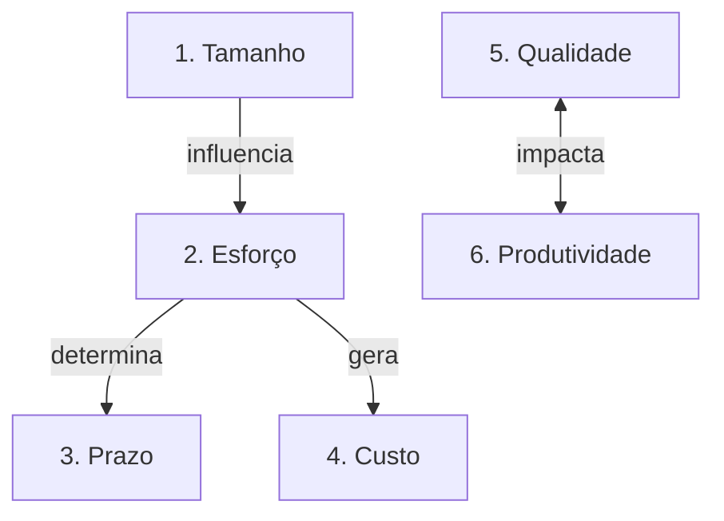

# Módulo 03 — Dimensões de Medição em Engenharia de Software

A medição em software engloba seis dimensões fundamentais interdependentes. Este módulo detalha cada uma delas e demonstra como elas se encadeiam no ciclo de vida de desenvolvimento.

---

## 🔗 As Seis Dimensões e suas Relações

---

## 📖 Capítulos do Módulo

- **[Tamanho](tamanho.md)** — Medição física (LOC) e funcional (APF/UCP).
- **[Esforço](esforco.md)** — Horas de trabalho e Pessoas-Mês (PM).
- **[Prazo](prazo.md)** — Duração de cronograma e unidades temporais.
- **[Custo](custo.md)** — Composição de custos diretos e indiretos de software.
- **[Qualidade](qualidade.md)** — Defeitos e satisfação do atributo.
- **[Produtividade](produtividade.md)** — Razão entre entrega e esforço aplicado.
