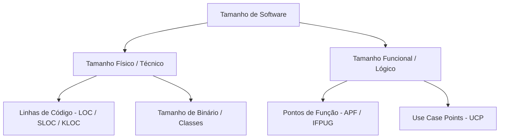

# Dimensão 1: Tamanho de Software

O **Tamanho** é a dimensão primária da medição em Engenharia de Software. Ele representa a magnitude física ou funcional do produto que será ou foi construído.

---

## 1. Tamanho Físico vs Tamanho Funcional

### Tamanho Físico (LOC / KLOC)
Mede a quantidade de código escrito. É altamente dependente da linguagem de programação e do estilo do programador.

### Tamanho Funcional (APF / UCP)
Mede a quantidade de funcionalidades entregues ao usuário, independentemente da linguagem, tecnologia ou arquitetura de implementação utilizada.

---

## 2. Exemplo Comparativo no Sistema de Biblioteca

| Métrica | Valor no Sistema de Biblioteca | O que expressa |
| :--- | :--- | :--- |
| **Linhas de Código (SLOC)** | 10.000 LOC (10 KLOC) | Volume de código em Python/JavaScript. |
| **Pontos de Função (APF)** | 50 PF | Quantidade de funções de dados e transações entregues. |
| **Use Case Points (UCP)** | 29 UCP | Complexidade baseada nos cenários de casos de uso. |

---

## 3. Você consegue responder?
1. O que diferencia o tamanho físico do tamanho funcional?
2. Por que a medição de tamanho funcional (APF) pode ser realizada antes da escrita do código?
3. Qual a limitação de comparar dois projetos em linguagens distintas usando apenas LOC?
4. Como o tamanho é utilizado como entrada para a estimativa de esforço?
5. Quais são as duas principais unidades de medida de tamanho funcional?

---

## 📚 Referências utilizadas
- **Fenton, N. E. & Bieman, J.** *Software Metrics: A Rigorous and Practical Approach*, 3rd ed., 2014.
- **IFPUG**. *Function Point Counting Practices Manual*, Release 4.3.1.
