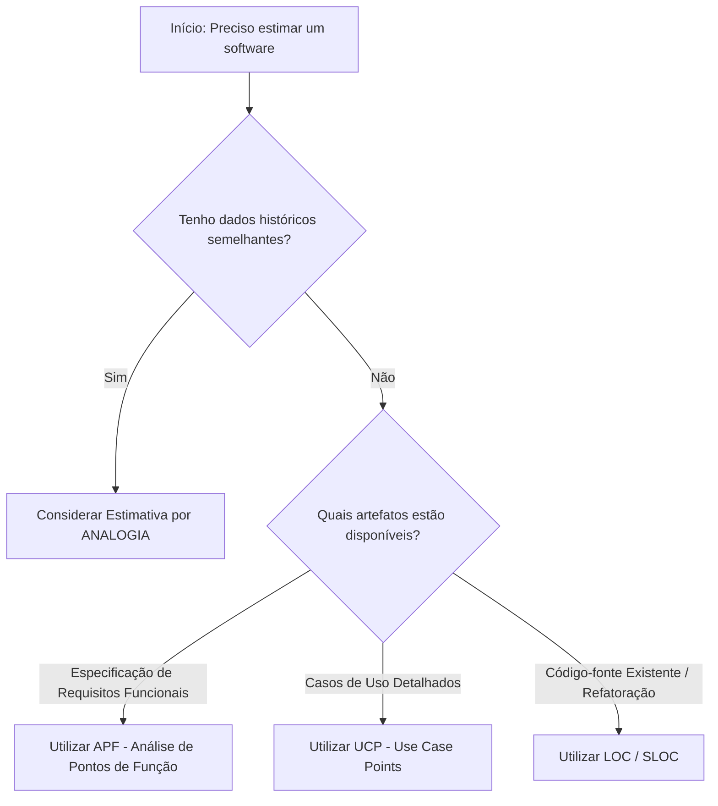

# Comparação de Técnicas de Estimativa

Este capítulo fornece o quadro comparativo e a árvore de decisão para orientação do estudante quanto à escolha da técnica de estimativa mais adequada ao contexto.

---

## 1. Tabela Comparativa Obrigatória

| Técnica | Base de Cálculo | Independente de Linguagem | Antes do Código | Principal Uso | Requisito de Entrada |
| :--- | :--- | :---: | :---: | :--- | :--- |
| **Analogia** | Dados históricos passados | Geralmente sim | Sim | Estimativa preliminar rápida | Projetos passados semelhantes catalogados |
| **LOC** | Contagem de linhas físicas/lógicas | Não | Parcialmente | Estimativa detalhada de tamanho físico | Histórico de produtividade LOC/h e arquitetura |
| **APF** | Funcionalidades de dados e transações | Sim | Sim | Estimativa de tamanho funcional e contrato | Requisitos funcionais especificados |
| **UCP** | Atores e fluxos de casos de uso | Sim | Sim | Estimativa baseada em Orientação a Objetos | Casos de uso estruturados e diagramados |

---

## 2. Árvore de Decisão Didática

---

## 3. Você consegue responder?
1. Qual técnica de estimativa é a mais recomendada quando se possui apenas os casos de uso do sistema?
2. Por que a APF é independente da linguagem de programação, enquanto a LOC não é?
3. Em que situação a Estimativa por Analogia supera as demais em velocidade?
4. Qual técnica deve ser evitada no início do projeto para estimar esforço de desenvolvimento do zero?
5. Como a maturidade dos requisitos condiciona a escolha da técnica de estimativa?

??? check "Mostrar Gabarito / Resposta"
    1. **Recomendação com Casos de Uso:** UCP (Use Case Points).
    2. **APF vs. LOC e Linguagem:** A APF mede requisitos funcionais sob a perspectiva do usuário (funções de dados e transações), enquanto o LOC mede o volume físico de linhas escritas, variando drasticamente de acordo com a verbosidade de cada linguagem.
    3. **Velocidade da Analogia:** Nas fases iniciais de estudo de viabilidade, quando não há tempo ou detalhes suficientes para contagens funcionais minuciosas (APF/UCP).
    4. **Técnica a evitar no início:** Estimativa baseada puramente em LOC (linhas de código), pois o código-fonte ainda não existe e a variabilidade de estimar contagem física antecipada é gigantesca.
    5. **Maturidade dos requisitos:** Requisitos vagos exigem estimativas por Analogia ou faixas amplas; requisitos funcionais definidos permitem APF/UCP; especificações técnicas detalhadas ou refatorações permitem estimativas baseadas em LOC ou modelos algorítmicos.

---

## 📚 Referências utilizadas
- **Fenton, N. E. & Bieman, J.** *Software Metrics*, 3rd ed.
- **McConnell, Steve**. *Software Estimation: Demystifying the Black Art*.
