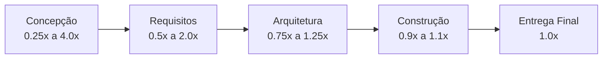

# Estimativa Contínua e o Cone da Incerteza

Estimar não é um evento único que ocorre apenas no primeiro dia do projeto. É um **processo contínuo de refinamento**.

---

## 1. O Cone da Incerteza (Cone of Uncertainty)

No início do projeto (fase de concepção), a margem de variabilidade da estimativa pode oscilar entre **0.25x (25%)** e **4.0x (400%)** do valor real final. À medida que requisitos são detalhados e o código é escrito, a incerteza afunila.



---

## 2. O Fluxo da Estimativa Contínua

```text
Ideia Inicial ──► Estimativa Conceitual (Faixa Larga)
     │
     ▼
Requisitos Detalhados ──► Estimativa Funcional (APF / UCP)
     │
     ▼
Desenvolvimento / Sprints ──► Re-estimativa por Dados Históricos / Velocity
```

---

## 3. Você consegue responder?
1. O que descreve o gráfico do Cone da Incerteza?
2. Por que a variabilidade no início do projeto pode chegar a 4x o valor real?
3. O que acontece com a margem de incerteza após a conclusão da fase de arquitetura?
4. Por que a estimativa deve ser atualizada em cada nova fase do projeto?
5. Qual é o erro de tentar travar o orçamento na fase de concepção sem prever faixas de incerteza?

---

## 📚 Referências utilizadas
- **McConnell, Steve**. *Software Estimation: Demystifying the Black Art*.
