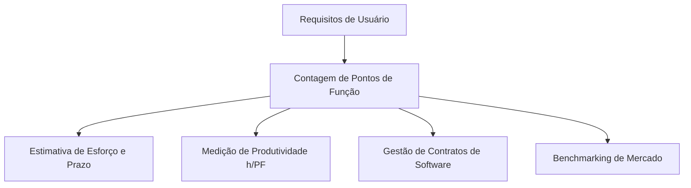

# Introdução à Análise de Pontos de Função (APF)

> 📚 **Conceito fundamentado em referência (IFPUG CPM 4.3.1 / Allan Albrecht 1979)**  
> A Análise de Pontos de Função (APF) mede o tamanho funcional do software sob a perspectiva das funcionalidades solicitadas e entregues aos usuários.

---

## 1. O que é?
Desenvolvida por Allan Albrecht na IBM em 1979 e posteriormente mantida e padronizada pelo **IFPUG** (*International Function Point Users Group*), a APF avalia o software com base na sua capacidade lógica de armazenar, recuperar e processar dados de negócio.

## 2. Por que existe?
Ela foi criada para resolver a principal limitação do LOC: permitir a medição do tamanho do software de forma consistente e comparável, independentemente das tecnologias, linguagens ou decisões de arquitetura adotadas no código.

---

## 3. Onde se Aplica a APF?

---

## 4. Você consegue responder?
1. Quem foi o criador da técnica de Análise de Pontos de Função?
2. Qual a organização internacional responsável por manter o padrão oficial da APF?
3. Por que a APF é considerada independente da linguagem de programação?
4. Qual a premissa de medição sob a visão do usuário?
5. Em quais momentos do desenvolvimento a APF pode ser realizada?

---

## 📚 Referências utilizadas
- **IFPUG**. *Function Point Counting Practices Manual (CPM)*, Release 4.3.1.
- **Albrecht, Allan J.** *Measuring Application Development Productivity*, IBM, 1979.
