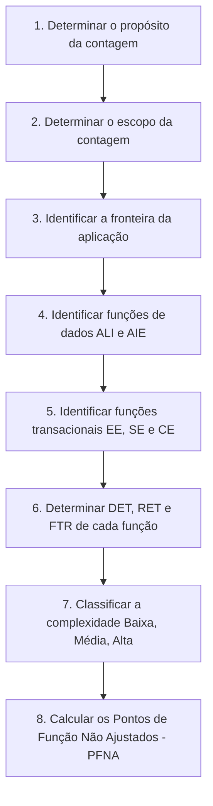

# Processo de Contagem APF

Segundo o manual oficial do IFPUG (CPM 4.3.1), o processo de medição funcional segue obrigatoriamente uma sequência estruturada de 8 passos.

---

## 1. As 8 Etapas do Processo de Contagem

---

## 2. As Três Tipologias de Contagem

1. **Contagem de Projeto de Desenvolvimento**: Mede o tamanho das funcionalidades entregues na primeira instalação de um software.
2. **Contagem de Projeto de Melhoria (Manutenção/Evolução)**: Mede o tamanho de alterações (inclusões, alterações e exclusões) em um software existente.
3. **Contagem de Aplicação**: Mede o tamanho funcional corrente do produto instalado e operacional.

---

## 3. Você consegue responder?
1. Quais são as 8 etapas sequenciais de uma contagem de Pontos de Função IFPUG?
2. Quais os três tipos de contagem previstos pelo IFPUG?
3. O que mede a contagem de Projeto de Melhoria?
4. Por que a identificação das funções de dados deve anteceder a identificação das funções transacionais?
5. Qual etapa do processo atribui as notas de peso funcional?

---

## 📚 Referências utilizadas
- **IFPUG**. *Function Point Counting Practices Manual*, Release 4.3.1.
