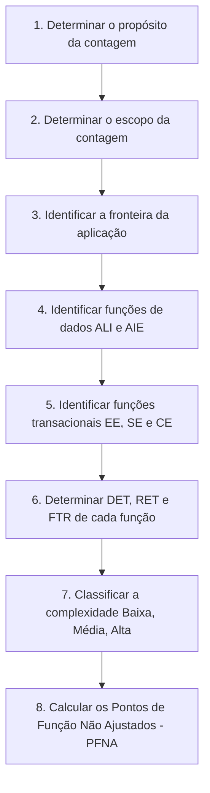

# Processo de Contagem APF

Segundo o manual oficial do IFPUG (CPM 4.3.1), o processo de medição funcional segue obrigatoriamente uma sequência estruturada de 8 passos.

---

## 1. As 8 Etapas do Processo de Contagem

---

## 2. As Três Tipologias de Contagem

1. **Contagem de Projeto de Desenvolvimento**: Mede o tamanho das funcionalidades entregues na primeira instalação de um software.
2. **Contagem de Projeto de Melhoria (Manutenção/Evolução)**: Mede o tamanho de alterações (inclusões, alterações e exclusões) em um software existente.
3. **Contagem de Aplicação**: Mede o tamanho funcional corrente do produto instalado e operacional.

---

## 3. Você consegue responder?
1. Quais são as 8 etapas sequenciais de uma contagem de Pontos de Função IFPUG?
2. Quais os três tipos de contagem previstos pelo IFPUG?
3. O que mede a contagem de Projeto de Melhoria?
4. Por que a identificação das funções de dados deve anteceder a identificação das funções transacionais?
5. Qual etapa do processo atribui as notas de peso funcional?

??? check "Mostrar Gabarito / Resposta"
    1. **8 Etapas sequenciais:** 
       1. Determinar o propósito da contagem;
       2. Identificar o escopo e a fronteira da aplicação;
       3. Identificar as Funções de Dados (ALIs e AIEs);
       4. Mensurar a complexidade e calcular o valor das Funções de Dados;
       5. Identificar as Funções Transacionais (EEs, SEs e CEs);
       6. Mensurar a complexidade e calcular o valor das Funções Transacionais;
       7. Calcular a pontuação final de Pontos de Função Não Ajustados (PFNA);
       8. Registrar a documentação da contagem.
    2. **Três tipos de contagem:** Contagem de Projeto de Desenvolvimento, Contagem de Projeto de Melhoria e Contagem de Aplicação.
    3. **Projeto de Melhoria:** Mede o tamanho funcional das funcionalidades incluídas, alteradas e excluídas em um software já existente.
    4. **Ordem de identificação:** Porque as transações (EE, SE, CE) fazem referência direta às funções de dados (ALIs e AIEs) como FTRs (*File Types Referenced*).
    5. **Etapa de atribuição de peso:** Nas etapas de mensuração da complexidade funcional de cada elemento (etapas 4 e 6).

---

## 📚 Referências utilizadas
- **IFPUG**. *Function Point Counting Practices Manual*, Release 4.3.1.
