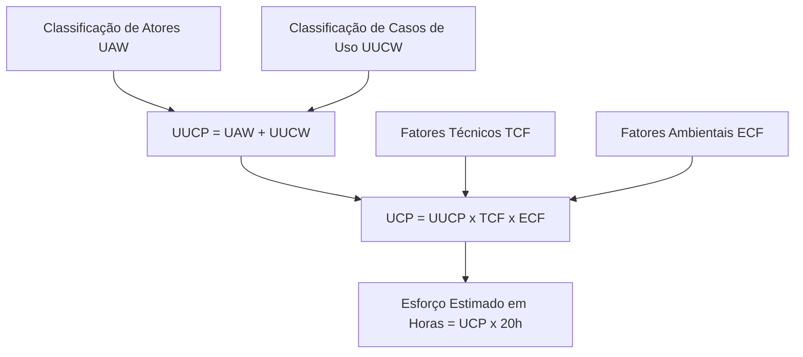

# Conceito de Use Case Points (UCP)

> 📚 **Conceito fundamentado em referência (Gustav Karner 1993)**  
> Use Case Points é uma métrica de estimativa derivada diretamente dos modelos de Casos de Uso (Atores e Diagramas de Casos de Uso UML).

---

## 1. Estrutura de Cálculo da Técnica UCP

---

## 2. As Equações Fundamentais de Karner

1. **Unadjusted Use Case Points (UUCP)**:
   $$\text{UUCP} = \text{UAW} + \text{UUCW}$$
2. **Technical Complexity Factor (TCF)**:
   $$\text{TCF} = 0.6 + \left( 0.01 \times \sum_{i=1}^{13} (w_i \times t_i) \right)$$
3. **Environmental Complexity Factor (ECF)**:
   $$\text{ECF} = 1.4 + \left( -0.03 \times \sum_{j=1}^{8} (w_j \times e_j) \right)$$
4. **Use Case Points Totais (UCP)**:
   $$\text{UCP} = \text{UUCP} \times \text{TCF} \times \text{ECF}$$

---

## 3. Você consegue responder?
1. Quem criou o método de Use Case Points (UCP)?
2. Qual o artefato base necessário para efetuar uma estimativa em UCP?
3. Quais são as quatro variáveis da fórmula final de UCP?
4. Escreva a equação de cálculo do UUCP.
5. Qual o fator padrão de conversão de UCP para horas proposto originalmente por Karner?

??? check "Mostrar Gabarito / Resposta"
    1. **Criador do UCP:** Gustav Karner (em 1993, na Objectory AB).
    2. **Artefato base:** A especificação de Casos de Uso (diagramas e descrições detalhadas de fluxos de atores e cenários).
    3. **Quatro variáveis principais:** UAW (*Unadjusted Actor Weight*), UUCW (*Unadjusted Use Case Weight*), TCF (*Technical Complexity Factor*) e ECF (*Environmental Complexity Factor*).
    4. **Equação do UUCP:**
       $$\text{UUCP} = \text{UAW} + \text{UUCW}$$
    5. **Fator padrão de Karner:** 20 horas-pessoa por UCP.

---

## 📚 Referências utilizadas
- **Karner, Gustav**. *Resource Estimation Based on Use Cases*, Objectory AB, 1993.
