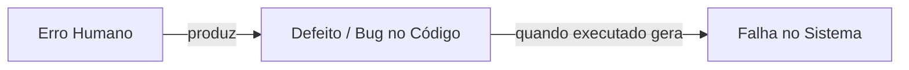

# Defeitos, Erros, Falhas e Bugs

A terminologia de anomalias em Engenharia de Software possui definições padronizadas pelo IEEE que devem ser respeitadas.

---

## 1. A Cadeia de Anomalia (IEEE 610.12)

- **Erro (Error / Mistake)**: Ação humana incorreta realizada pelo desenvolvedor, analista ou projetista.
- **Defeito (Defect / Bug / Fault)**: Imperfeição lógica ou sintática presente no código-fonte, documento ou requisito.
- **Falha (Failure)**: Evento em tempo de execução no qual o software manifesta um comportamento divergente do esperado pelo usuário.

---

## 2. Severidade vs Prioridade

- **Severidade**: Impacto técnico da falha no funcionamento do produto (ex: Crítica, Alta, Média, Baixa).
- **Prioridade**: Urgência de negócio para a correção do defeito.

---

## 3. Você consegue responder?
1. Qual a diferença formal entre Erro, Defeito e Falha segundo o IEEE?
2. Um bug não executado no código é um defeito ou uma falha?
3. O que distingue a Severidade de um defeito da sua Prioridade?
4. Dê um exemplo de defeito de alta severidade mas baixa prioridade.
5. Por que identificar defeitos em fases iniciais reduz exponencialmente o custo de correção?

??? check "Mostrar Gabarito / Resposta"
    1. **Diferenças formais (IEEE):**
       - *Erro (Fault/Human Error):* Ação humana incorreta cometida pelo desenvolvedor/analista.
       - *Defeito (Bug/Defect):* A imperfeição introduzida no artefato de código/documento como resultado do erro humano.
       - *Falha (Failure):* O desvio do comportamento esperado percebido durante a execução do programa.
    2. **Bug não executado:** É um **defeito**. Só se torna uma **falha** no momento em que o código é executado e o erro se manifesta.
    3. **Severidade vs. Prioridade:** Severidade é o impacto técnico/funcional que o defeito causa no sistema (ex: quebra de banco vs erro de digitação). Prioridade é a urgência de negócio estipulada para corrigir o defeito no cronograma.
    4. **Exemplo Alta Severidade / Baixa Prioridade:** Um crash total da aplicação que ocorre apenas ao utilizar um sistema operacional obsoleto que representa 0,01% dos usuários.
    5. **Redução de custo de correção:** Corrigir na fase de requisitos custa uma fração do valor; em produção, envolve refatoração, novos testes, novo deploy e possível prejuízo de imagem ou indenizações.

---

## 📚 Referências utilizadas
- **IEEE Computer Society**. *SWEBOK V4.0a*, Chapter 10.
- **Kan, S. H.** *Metrics and Models in Software Quality Engineering*, 2nd ed.
