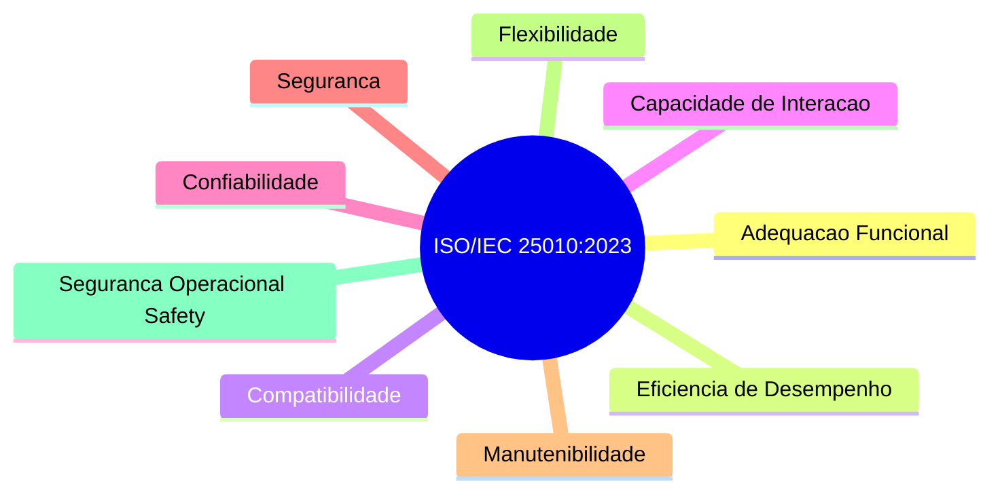

# O Modelo ISO/IEC 25010:2023

A versão atualizada **ISO/IEC 25010:2023** (*Systems and software engineering — SQuaRE — Product quality model*) estabelece **nove características** no modelo de qualidade de produto de software.

---

## 1. As 9 Características de Qualidade de Produto (ISO 25010:2023)

---

## 2. Descrição Sintética das 9 Características

1. **Adequação Funcional (Functional Suitability)**: Grau em que as funções atendem às necessidades declaradas (Completude, Correção e Adequação).
2. **Eficiência de Desempenho (Performance Efficiency)**: Desempenho relativo à quantidade de recursos utilizados (Comportamento no tempo, Utilização de recursos, Capacidade).
3. **Compatibilidade (Compatibility)**: Capacidade de trocar informações com outros sistemas e compartilhar o mesmo ambiente (Coexistência e Interoperabilidade).
4. **Capacidade de Interação (Interaction Capability / Usability)**: Grau em que o produto pode ser usado por usuários para alcançar metas com eficácia e satisfação (Adequação de reconhecibilidade, Aprendizado, Operabilidade, Proteção contra erros de usuário, Estética da interface, Acessibilidade).
5. **Confiabilidade (Reliability)**: Grau em que o sistema executa funções especificadas sob condições especificadas (Maturidade, Disponibilidade, Tolerância a falhas, Recuperabilidade).
6. **Segurança (Security)**: Grau em que o sistema protege informações e dados contra acessos não autorizados (Confidencialidade, Integridade, Não repúdio, Autenticidade, Responsabilização).
7. **Manutenibilidade (Maintainability)**: Eficiência com que o produto pode ser modificado (Modularidade, Reutilização, Analisabilidade, Modificabilidade, Testabilidade).
8. **Flexibilidade (Flexibility)**: Capacidade do produto ser adaptado a mudanças de requisitos ou contextos operacionais (Adaptabilidade, Escalabilidade).
9. **Segurança Operacional (Safety)**: Grau em que o sistema evita riscos de danos à vida humana, propriedade ou meio ambiente.

---

## 3. Você consegue responder?
1. Quantas características compõem o modelo de qualidade de produto da ISO/IEC 25010:2023?
2. Qual a diferença entre a característica de Segurança (*Security*) e Segurança Operacional (*Safety*)?
3. O que avalia a Manutenibilidade de um produto de software?
4. Quais as subcaracterísticas da Adequação Funcional?
5. Qual norma substituiu a antiga ISO/IEC 9126 no padrão internacional de qualidade?

---

## 📚 Referências utilizadas
- **ISO/IEC 25010:2023**. *SQuaRE — Product quality model*.
