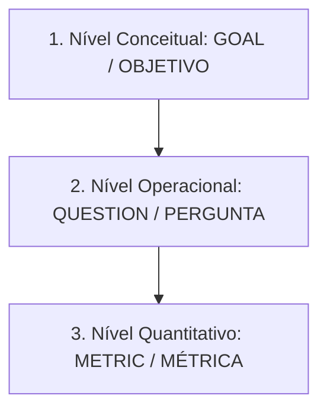

# Conceito do Paradigma GQM

> 📚 **Conceito fundamentado em referência (Basili, Caldiera & Rombach 1994 / SEI)**  
> O paradigma GQM estabelece uma hierarquia de três níveis (Nível Conceitual, Nível Operacional e Nível Quantitativo) para garantir que nenhuma métrica seja coletada sem um objetivo de negócio claro.

---

## 1. As Três Camadas do GQM

1. **GOAL (Objetivo)**: Define o que se deseja alcançar (para qual produto/processo, com qual propósito, sob qual ponto de vista).
2. **QUESTION (Pergunta)**: Conjunto de questões analíticas que caracterizam a avaliação do objetivo.
3. **METRIC (Métrica)**: Conjunto de medições quantitativas necessárias para responder empiricamente às perguntas formuladas.

---

## 2. Variante GQIM (SEI)
A extensão do SEI incorpora o elemento **Indicador (Indicator)** entre a pergunta e a métrica:

$$\text{GOAL} \longrightarrow \text{QUESTION} \longrightarrow \text{INDICATOR} \longrightarrow \text{METRIC}$$

---

## 3. Você consegue responder?
1. Quais são os três níveis da hierarquia GQM proposta por Victor Basili?
2. Por que o GQM impede a coleta de métricas inúteis ("coletar dados por coletar")?
3. O que acrescenta o modelo GQIM proposto pelo SEI?
4. Qual a direção do fluxo de planejamento no GQM (top-down ou bottom-up)?
5. Quem é o autor principal do paradigma GQM?

---

## 📚 Referências utilizadas
- **Basili, V. R., Caldiera, G., & Rombach, H. D.** *The Goal Question Metric Approach*, 1994.
- **Software Engineering Institute (SEI)**. *Goal-Driven Software Measurement*.
