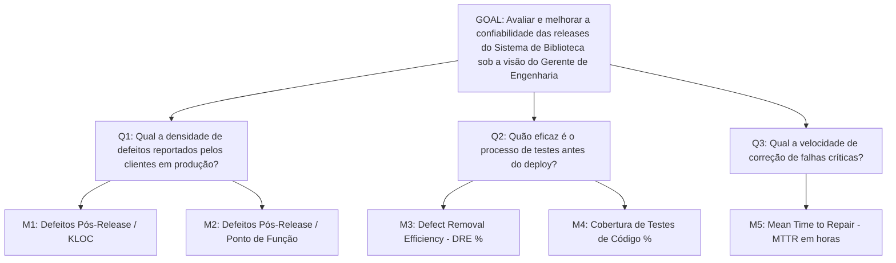

# Exemplos Práticos de Árvores GQM

Exemplo completo de uma árvore GQM aplicada ao *Sistema de Biblioteca*.

---

## 1. Árvore GQM Integrada: Qualidade e Confiabilidade



---

## 2. Execução via Script Python de Exemplo

Você pode explorar esta estrutura executando o script de exemplo em `examples/gqm/example_gqm.py`:

```bash
python examples/gqm/example_gqm.py
```

---

## 3. Você consegue responder?
1. Quantas perguntas e métricas compõem a árvore GQM de exemplo acima?
2. Como a métrica DRE auxilia a responder a pergunta Q2?
3. O que aconteceria se a equipe medisse o número de commits diários sem adicionar essa métrica à árvore GQM?
4. Mostre como alterar o objetivo GQM acima para focar no custo financeiro do projeto.
5. Qual a vantagem visual e conceitual de representar uma estratégia de medição via diagrama de árvore GQM?

---

## 📚 Referências utilizadas
- **Basili, V. R., Caldiera, G., & Rombach, H. D.** *The Goal Question Metric Approach*, 1994.
