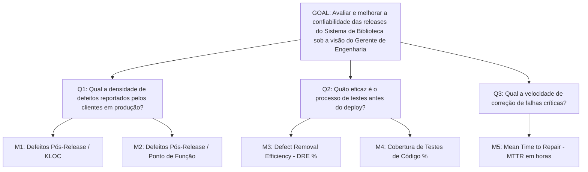

# Exemplos Práticos de Árvores GQM

Exemplo completo de uma árvore GQM aplicada ao *Sistema de Biblioteca*.

---

## 1. Árvore GQM Integrada: Qualidade e Confiabilidade



---

## 2. Execução via Script Python de Exemplo

Você pode explorar esta estrutura executando o script de exemplo em `examples/gqm/example_gqm.py`:

```bash
python examples/gqm/example_gqm.py
```

---

## 3. Você consegue responder?
1. Quantas perguntas e métricas compõem a árvore GQM de exemplo acima?
2. Como a métrica DRE auxilia a responder a pergunta Q2?
3. O que aconteceria se a equipe medisse o número de commits diários sem adicionar essa métrica à árvore GQM?
4. Mostre como alterar o objetivo GQM acima para focar no custo financeiro do projeto.
5. Qual a vantagem visual e conceitual de representar uma estratégia de medição via diagrama de árvore GQM?

??? check "Mostrar Gabarito / Resposta"
    1. **Estrutura do exemplo:** 2 perguntas (Q1 sobre densidade de defeitos e Q2 sobre eficácia de testes) e 3 métricas associadas (M1: Defeitos em Produção, M2: KLOC e M3: DRE - Defect Removal Efficiency).
    2. **Papel da métrica DRE em Q2:** Mede a porcentagem de defeitos capturados antes da entrega, respondendo diretamente se a esteira de testes é eficaz na contenção de falhas.
    3. **Medição de commits sem GQM:** Seria um desperdício de esforço de medição (métrica órfã), pois commits diários não respondem às perguntas de qualidade definidas no objetivo.
    4. **Alteração do Objetivo para Custo:**
       - *Analisar* o processo de desenvolvimento
       - *Com o propósito de* avaliar e otimizar o custo de entrega
       - *Sob o foco de* eficiência financeira (R$/PF)
       - *Do ponto de vista do* Diretor Financeiro (CFO)
       - *No contexto do* projeto de migração de nuvem.
    5. **Vantagem do diagrama de árvore:** Torna evidente a rastreabilidade direta entre os dados numéricos coletados na ponta e os objetivos estratégicos de alto nível da organização.

---

## 📚 Referências utilizadas
- **Basili, V. R., Caldiera, G., & Rombach, H. D.** *The Goal Question Metric Approach*, 1994.
