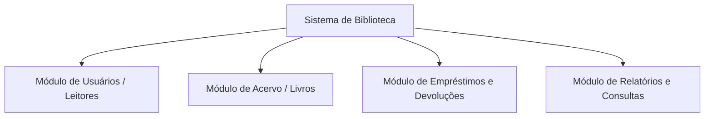

# Módulo 11 — Estudo de Caso Central: Sistema de Biblioteca

O **Estudo de Caso Central** atravessa todo o repositório educacional. O mesmo sistema fictício ("Sistema de Biblioteca") é submetido sequencialmente a todas as medições para permitir comparação direta entre as abordagens.

---

## 🎯 Visão Geral do Sistema de Biblioteca

O *Sistema de Biblioteca* é uma aplicação corporativa para gestão de acervos, leitores, empréstimos e relatórios gerenciais.

---

## 📖 Capítulos do Módulo

- **[Especificação de Requisitos](requisitos.md)** — Lista oficial de Requisitos Funcionais.
- **[Medição em LOC](loc.md)** — Análise física do código-fonte Python.
- **[Medição em APF](apf.md)** — Contagem funcional IFPUG (53 PF).
- **[Medição em UCP](ucp.md)** — Estimativa por Use Case Points (52.77 UCP).
- **[Avaliação de Qualidade](qualidade.md)** — Densidade de defeitos e DRE.
- **[Análise de Produtividade](produtividade.md)** — Taxas de esforço e produtividade.
- **[Comparação Final](comparacao-final.md)** — Síntese comparativa dos resultados.
