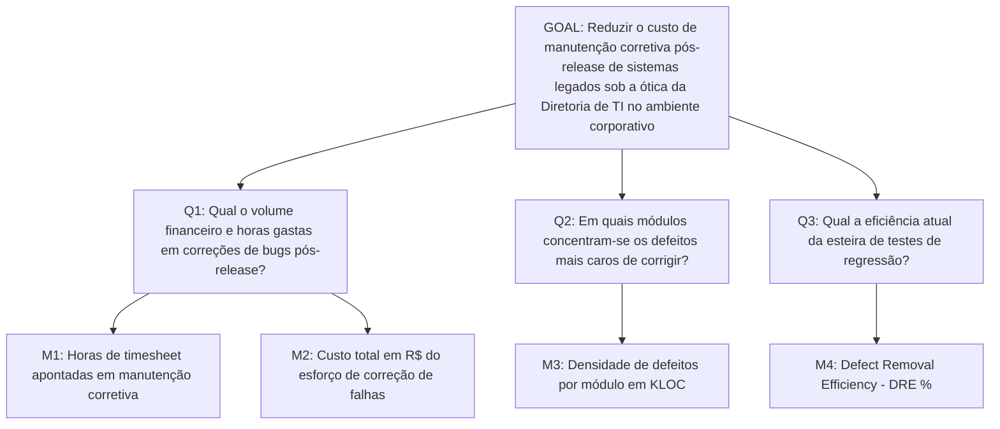

# Respostas: Paradigma GQM

---

### Solução do Exemplo 01 🟢
- **Objeto**: O processo de testes automatizados.
- **Propósito**: Aumentar.
- **Foco de Qualidade**: A cobertura de código.
- **Ponto de Vista**: O Líder Técnico.
- **Contexto**: O projeto Sistema de Biblioteca.

---

### Solução do Exemplo 02 🟡
- **GOAL**: Melhorar a previsibilidade de entregas das sprints sob a ótica do Scrum Master.
- **Question 1**: Quanto a quantidade de trabalho entregue varia entre sprints?
  - *Métrica 1.1*: Desvio padrão do Velocity (Story Points/sprint)
  - *Métrica 1.2*: Percentual de histórias completadas vs planejadas (%)
- **Question 2**: Quanto o escopo flutua após o início da sprint?
  - *Métrica 2.1*: Quantidade de pontos adicionados pós-Sprint Planning
  - *Métrica 2.2*: Quantidade de pontos removidos pós-Sprint Planning

---

### Solução do Exemplo 03 🔴

