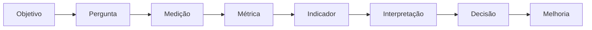

# 📊 Métricas de Software — Medição, Estimativas e Qualidade

> Um repositório educacional para aprender métricas, medição, estimativas, qualidade e produtividade em Engenharia de Software.

---

## 🎯 Filosofia do Projeto

Em Engenharia de Software, o ato de medir nunca deve ser tratado como um fim em si mesmo. 

> **Não medir por medir. Medir para compreender, decidir e melhorar.**



---

## 🧭 Como Estudar este Conteúdo

Este repositório foi projetado para acompanhamento progressivo:

```text
TEORIA ──► EXEMPLOS ──► CÁLCULOS ──► EXERCÍCIOS ──► ESTUDO DE CASO ──► APLICAÇÃO PRÁTICA
```

### 🗺️ Módulos de Aprendizagem

- **[01. Fundamentos](01-fundamentos/index.md)**: Diferença entre medição, medida, métrica e indicador.
- **[02. Tipos de Métricas](02-tipos-de-metricas/index.md)**: Classificação em Produto, Processo e Projeto.
- **[03. Dimensões](03-dimensoes/index.md)**: Tamanho, Esforço, Prazo, Custo, Qualidade e Produtividade.
- **[04. Estimativas](04-estimativas/index.md)**: Cone da incerteza e técnicas de estimativa.
- **[05. LOC (Lines of Code)](05-loc/index.md)**: Linhas de código físicas e lógicas.
- **[06. APF (Análise de Pontos de Função)](06-apf/index.md)**: Tamanho funcional baseado no padrão IFPUG.
- **[07. UCP (Use Case Points)](07-ucp/index.md)**: Estimativa por Casos de Uso segundo Karner.
- **[08. Qualidade de Software](08-qualidade/index.md)**: Modelo ISO/IEC 25010:2023 e densidade de defeitos.
- **[09. Métricas Ágeis](09-metricas-ageis/index.md)**: Lead Time, Cycle Time, Throughput e Velocity.
- **[10. GQM (Goal-Question-Metric)](10-gqm/index.md)**: Derivação de métricas a partir de objetivos.
- **[11. Estudo de Caso Central](11-estudo-de-caso/index.md)**: Aplicação comparativa no "Sistema de Biblioteca".
- **[12. Exercícios](12-exercicios/index.md)**: Questões conceituais e de cálculo.
- **[13. Respostas](13-respostas/index.md)**: Gabarito e resoluções passo a passo.
- **[14. Glossário](14-glossario/index.md)**: Siglas e terminologia técnica.

---

## 🔬 Biblioteca e CLI em Python

Além da teoria, o repositório disponibiliza a biblioteca educacional Python `software_metrics`:

```bash
# Instalação
pip install -r requirements.txt
pip install -e .

# Exemplo via CLI
python -m software_metrics productivity --size 10000 --effort 500
```
